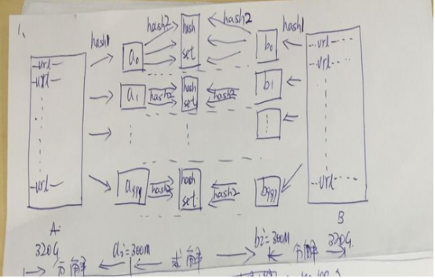

# 1. 海量日志数据, 提取出某日访问最多的 IP
1. IP 地址最多有 `2 ^ 32 = 4G` 中取值情况, 不能完全加载到内存中处理;
2. 可以考虑采用 `分治` 的思想, 按照 `IP MOD 1024`, 把海量的 IP 日志分别存储到 1024 个小文件中;
3. 对于小文件, 可以构建一个 ip 为 key, 出现次数为 value 的 HashMap, 同时记录当前出现次数最多的 IP;
4. 可以得到 1024 个小文件中出现次数最多的 ip, 再依据常规的排序算法得到总体上出现次数最多的 ip;

# 2. 搜索引擎会通过日志文件把用户每次搜索使用的所有检索串记录下来, 每个查询串的长度为 1- 255 字节
假设目前有 10000000 个记录(重复度较高, 虽然总数是 10000000, 但去重之后不超过 3000000), 需要统计最热门的 10 个查询串, 要求使用的内存不能超过 1G
### 2.1 Query 统计
统计 Query 有两个方法可供选择
#### 1. 直接排序
首先能够想到的就是直接排序, 再遍历排序好的 query, 统计每个 query 出现的次数.

但题目中有明确的要求, 内存不能超过 1G, 因此可以使用外部排序的方法来进行排序, 比如使用归并排序, 在不要求空间复杂度的前提下, 归并排序可以在 `O(NlogN)` 下完成排序

排序时间复杂度 `O(logN)`, 遍历时间复杂度 `O(N)`

#### 2. HashTable
虽然有 10000000 个 Query, 但由于重复度比较高, 实际上只有 3000000 个 Query, 每个 Query 255 byte, 因此可以考虑放进内存.

HashTable 查询速度非常快, 几乎可以在 `O(1)` 完成

> 维护一个 key 为 Query, value 为该 Query 出现次数的 HashTable, 每次读取一个 Query, 如果该字符串不在 Table 中, 那么加入该 Query, 并且将 Value 置为 1; 如果该 Query 在 table 中, 那么将该 Query 计数 +1 即可

### 2.2 找出 Top 10
#### 1. 普通排序
排序的时间复杂度是 `O(NlogN)`
#### 2. 部分排序
没必要对所有 Query 都进行排序, 只需要维护一个 10 个元素的数组, 初始化放入 10 个 Query, 依次排序, 按照每个 Query 统计的次数排序, 然后遍历这 300 万条记录, 和该数组进行比较和替换, 时间复杂度 `O(N * K)`, 其中 k 是 top k 的值.
#### 3. 堆
维护一个 10 个元素的堆, 时间复杂度降低到 `O(N * logK)`

# 3. 给定 a, b 两个文件, 各存放 50亿 个 URL, 每个 URL 占 64字节, 内存限制 4G, 找出两个文件相同的 URL
1. 遍历文件 a, 对每个 URL 求取 hash(url) % 1024, 然后根据所得的值将 URL 分别存储到 1024 个小文件中;
2. 遍历文件 b, 采取和 a 相同的方式将 URL 分别存储到 1024 个小文件;  
这样处理后, 所有可能相同的 URL 都被保存在同一个小文件中(a0/b0, a5/b5), 不对应的小文件不可能有相同的 URL, 然后只需要分别求出 1024 对小文件中相同的 URL 即可;
3. 求每对小文件`(a[i]/b[i])` 的时候, 可以把 a[i] 的 URL 存储到 HashSet 中, 然后遍历 b[i] 的每个 URL, 看是否包含

# 4. 在 2.5 亿个整数中, 找出不重复的整数
采用 `bit map`(每个数分别 2 bit, 00 表示不存在, 01表示出现一次, 10 表示多次, 11 无意义)

扫描这 2.5 亿个整数, 查看 bit map 中相应位, 如果是 00 变 01, 01 变 10, 10 保持不变

最后查看 bitmap, 把对应位是 01 的整数输出即可

# 5. 给 40 亿个无序不重复的 unsigned int 整数, 如果快速判断某个数是否在这 40 亿个整数中?
2 ^ 31 = 2147483638, 40亿 < `2 ^ 33`

2 ^ 33 = (2 ^ 8) * (2 ^ 10) * (2 ^ 10) * (2 ^ 5) 个 byte = 32 MB

因此我们可以申请 32 MB 空间, 做一个 BitMap, 读入 40 亿个数字, 设置在相应的 bit 位上, 1 表示存在, 0 表示不存在