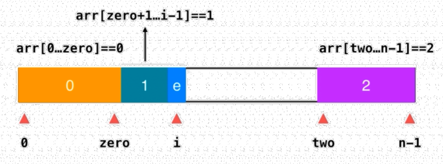

# 1. 题目描述
> Given an array with n objects colored red, white or blue, sort them in-place so that objects of the same color are adjacent, with the colors in the order red, white and blue.  
Here, we will use the integers 0, 1, and 2 to represent the color red, white, and blue respectively.  
Note: You are not suppose to use the library's sort function for this problem.

 
---

> 给定一个包含红色、白色和蓝色，一共 n 个元素的数组，原地对它们进行排序，使得相同颜色的元素相邻，并按照红色、白色、蓝色顺序排列。  
此题中，我们使用整数 0、 1 和 2 分别表示红色、白色和蓝色。  
注意: 不能使用代码库中的排序函数来解决这道题。

    输入: [2,0,2,1,1,0]
    输出: [0,0,1,1,2,2]
    
# 2. 求解
## 2.1 计数排序
> 适用于数组元素取值范围很少的情况, 第一次遍历找出所有元素出现的次数, 第二次遍历进行依次赋值.

```java
class Solution {
    public void sortColors(int[] nums) {
        int[] cntArray = new int[]{0, 0, 0};
        for (int i = 0; i < nums.length; ++i) {
            // 第一次遍历, 求出每个取值的数量
            cntArray[nums[i]]++;
        }
        
        // 赋值过程
        int index = 0;
        for (int i = 0; i < cntArray[0]; ++i) {
            nums[index++] = 0;
        }
        for (int i = 0; i < cntArray[1]; ++i) {
            nums[index++] = 1;
        }
        for (int i = 0; i < cntArray[2]; ++i) {
            nums[index++] = 2;
        }      
    }
}
```

## 2.2 荷兰国旗算法
> 类似三路快排的一次执行



| 下标 | 功能 |
|---|---|
| zero | 保证其之前的区域 `[0 ... zero]` 全部都存 0 |
| two | 保证其之后的区域 `[two ... n - 1]` 全部都存 2 |
| i | 在 zero 和 two 之间, 标识当前处理的元素, 同时保证 `[zero + 1 ... i - 1]` 之间的元素都是 1 |

```java
class Solution {
    public void sortColors(int[] nums) {
        // 因为该区间是 [0, zero], 因此初始值不能为 0, 必须是 -1
        int zero = -1;
        // 同理, 该区间是 [two, n - 1]
        int two = nums.length;
        for (int i = 0; i < two;) {
            if (nums[i] == 1) {
                ++i;
            } else if (nums[i] == 0) {
                // 如果为 0, 和 zero 索引最后一个互换, 同时 i + 1, zero + 1
                swap(nums, ++zero, i++);
            } else if (nums[i] == 2) {
                // 如果为 2, 和 two 的前一个索引互换位置, 同时 two - 1, 而原 i 位置的元素需要重新处理, 故不能更新
                swap(nums, i, --two);
            }
        }
    }
    
    private void swap(int[] nums, int a, int b) {
        int temp = nums[a];
        nums[a] = nums[b];
        nums[b] = temp;
    }
}
```