# 1. 架构设计的复杂度

> 架构设计的主要目的是为了解决软件系统复杂度带来的问题

下面先来分析一下架构设计常见的复杂度问题:

## 1.1 高性能
软件系统中, 高性能带来的复杂度主要体现在两方面:
- 单机内部高性能的复杂度
- 集群之间高性能的复杂度

### 1.1.1 单机复杂度
操作系统的复杂度直接决定了软件系统的复杂度

操作系统和性能最相关的就是进程和线程:
- 进程用来对应一个任务, 每个人物都有自己独立的内存空间, 进程间互不相关, 由操作系统来进行调度, 操作系统把 CPU 分成多个时间片, 每个时间片只能执行某个进程中的指令, 为了让进程能够相互通信, 可以使用管道, 消息队列, 信号量, 共享存储等;  
- 多进程让多个任务能够并行处理, 但自身还有缺点, 单个进程内部只能串行处理, 而实际上很多进程内部的子任务并不要求严格按照时间顺序执行, 也需要并行处理, 因此发明了线程, 操作系统调度的最小单位变成了线程, 而进程变成了操作系统分配资源的最小单位.

### 1.1.2 集群复杂度
通过大量机器来提升性能, 并不仅仅是增加机器这么简单, 让多台机器配合完成高性能, 是一个复杂的任务.

#### 1. 任务分配
> 每台机器都可以处理完整的任务, 不同的任务分配到不同的机器上执行

在 1 台服务器变为 2 台之后, 新引入的问题:
1. 需要新增一个任务分配器, 可能是硬件网络设备(F5, 交换机), 可能是软件网络设备(LVS), 也可能是负载均衡软件(Nginx);
2. 任务分配器和真正的业务服务器之间对连接的管理, 比如连接建立, 连接管理, 异常中断后如何处理等;
3. 任务分配器需要增加分配算法, 轮询, 加权等

如果对性能的要求更进一步, 单台任务分配器可能会成为瓶颈, 因此就需要多台任务分配器

此时架构的复杂性体现在:
1. 任务分配器由 1 台变为多台, 需要将不同用户分配到不同任务分配器上, 常见方法包括 DNS 轮询, CDN 等
2. 任务分配器和业务服务器的关系从 `一对多` 变成了 `多对多`
3. 随着节点数量的增加, 状态管理, 故障处理复杂度也增加

#### 2. 任务分解
通过任务分配的方式, 能够突破单台机器的瓶颈, 但如果任务本身很复杂, 单纯只通过任务分配的方式来扩展性能存在瓶颈, 因此需要考虑任务分解

通过这种任务分解的方式, 能够把原来统一但复杂的业务拆分成小而简但需要多个系统配合的业务系统.

任务分解可以提升性能的原因:
1. 简单的系统更容易做到高性能, 功能越简单, 影响性能的点就越少, 就更容易进行针对性的优化.
2. 可以针对单个子任务进行扩展, 只需要针对有瓶颈的子系统进行优化

## 1.2 高可用

> 系统无中断地执行其功能的能力, 代表系统的可用程度, 是进行系统设计的准则之一.

硬件和软件本质上都无法做到 `无中断`, 在架构设计上, 本质都是通过 `冗余` 来实现高可用.

    高性能通过增加节点扩展处理能力, 高可用通过增加节点冗余处理单元
    

### 1.2.1 计算高可用
> 计算的特点: 无论在那台机器上进行, 相同的算法和输入数据, 产出的结果都一样

### 1.2.2 存储高可用
> 存储的特点: 将数据从一台机器搬到另一台机器, 需要经过线路进行传输  
数据 + 逻辑 = 业务  
业务如果需要保持一致, 不同节点上的逻辑和数据必须一致

存储高可用的难点不在于如何备份数据, 而是在于如何减少或者规避不一致对业务造成的影响.

### 1.2.3 高可用状态决策
系统需要能够判断当前节点的状态是正常还是异常, 如果出现了异常就要采取行动来保证高可用

#### 1. 独裁式

> 存在一个独立的主体, 负责收集信息并完成决策

此模式不存在决策混乱, 但因为只有一个决策者, 如果决策者本身发生故障, 整个系统就无法实现准确的状态决策.

#### 2. 协商式

> 2 个独立的个体通过交流信息, 根据规则进行决策, 最常见的就是主备决策
- 2 个节点启动时都是备机
- 2 个节点建立连接, 并交换状态信息
- 某个节点作出决策, 成为主机, 另一个节点继续保持备机身份

协商式决策存在的问题:
1. 备机在连接中断的情况下认为主机故障, 自身升级为主机, 但实际上此时主机并没有故障, 出现 2 台主机
2. 备机在连接中断的情况下不认为主机故障, 此时主机故障

#### 3. 选举式

> 多个独立的节点通过投票的方式进行状态决策

每个个体做出自己的决策, 然后按照多数通过的规则来确定最终的状态

选举式决策有一个天生的问题: `脑裂`, 当发生网络分区时, 集群被割裂成多数派和少数派, 都无法和外界联系, 从而认为对方节点下线, 自身集群内部进行决策.
此时一般采用 `投票节点必须超过系统总节点半数` 的规则来处理.

## 1.3 可扩展性
> 可扩展性是指为了应对将来需求变化而提供的一种扩展能力, 当新需求出现时, 现有系统仅需少量变动就可支持

设计良好扩展性的系统, 有两个基本条件:
- 正确预测变化
- 完美封装变化

### 1.3.1 预测变化
预测变化的复杂性在于:
- 不能每个设计点都考虑可扩展性
- 不能完全不考虑可扩展性
- 所有的预测都存在出错的可能

### 1.3.2 封装变化
#### 1. 将变化封装在变化层, 将不变部分封装在独立的稳定层

通过玻璃变化层和稳定层, 会带来如下复杂度问题:
- 系统需要拆分出变化层和稳定层
- 需要设计变化层和稳定层之间的接口

## 1.4 低成本, 安全, 规模
### 1.4.1 低成本
如果架构方案设计一定规模的服务器, 成本就会变成一个非常重要的架构设计考虑点.

低成本给架构设计带来的复杂度主要体现在: 往往只有 `创新` 才能达到低成本目标, 比如引入新的技术:
- NoSQL 的出现就是为了解决关系型数据库无法应对高并发访问带来的访问压力
- 全文搜索引擎 的出现就是为了解决关系型数据库 like 搜索的低效问题
- Hadoop 的出现是为了解决传统文件系统无法应对海量数据存储和计算的问题

### 1.4.2 安全
#### 1. 功能安全
如 CSRF 攻击, SQL 注入等

现在很多开发框架都内嵌的常见的安全功能, 比如 MyBatis 防止 SQL 注入等, 也需要作为架构设计的一环去考虑

#### 2. 架构安全
传统的架构安全主要依靠防火墙, 防火墙最基本的功能就是网络隔离, 通过将网络划分成不同区域, 制定出不同区域之间的访问控制策略来控制不同欣喜程度区域间传送的数据流.

### 1.4.3 规模
规模带来的复杂度的主要原因是 `量变引起质变`, 当数量超过一定的阈值之后, 复杂度会发生质变
- 功能越来越多, 导致系统复杂度指数级上升
- 数据越来越多, 系统复杂度发生质变

# 2. 架构设计的原则
1. 合适原则: 合适优于业界领先
2. 简单原则: 简单优于复杂
3. 演化原则: 演化优于一步到位

# 3. 架构设计流程
结合复杂度来源和架构设计原则, 来设计一个场景 `旧浪微博`

## 3.1 识别复杂度
> 架构设计的本质是为了解决软件系统的复杂度问题, 因此需要先正确的分析系统的复杂性

架构的复杂度主要来源于 `高性能`, `高可用`, `可扩展` 三个方面

需要先将主要的复杂度问题列出来, 然后根据业务, 技术, 团队等综合情况进行排序, 优先解决当前面临最主要的复杂度问题

    假设旧浪微博是一个创业公司, 业务发展很快, 系统间协作效率很低:
    1. 用户发一条微博后, 微博子系统需要通知审核子系统进行审核, 然后通知统计子系统进行统计,
        再通知广告子系统进行广告预测, 接着再通知消息子系统进行统计消息推送...一条微博又十几
        个通知, 目前都是通过系统间接口调用, 每通知一个新系统, 微博子系统就要设计接口, 联调
        测试, 效率很低.
    2. 当用户到达 VIP 后, 等级子系统要通知福利子系统进行奖品发放, 要通知客服子系统安排专属
        服务人员等
        
    通过分析发现, 问题在于业务系统之间强耦合, 而 MQ 正好可以完成子系统的解耦.
    
    自研一个消息系统, 分析复杂度的过程如下:
    1. 消息的是否需要可靠性:
        假设旧浪微博系统用户每天发送 1000 万条微博, 那么微博子系统每天会产生 1000 万条消息,
        假设每个消息会有 10 个子系统读取, 那么其他子系统读取消息大约是 1 亿次;
        平均每秒写入消息数为 115 条, 读取的消息数应该是 1150 条, 考虑到系统不是完全平均的, 
        设计的目的应该是以峰值来计算, 峰值一般是平均值的 3 倍, 那么消息队列的 TPS 是345, QPS
        是 3450.
        因此高性能是复杂度之一;
    2. 是否需要高可用:
        对于微博子系统来说, 如果消息丢了, 导致没有审核, 是非常严重的事情; 对于等级子系统来说,
        如果用户到达相应等级, 系统没有奖励, 则用户会产生不满, 虽然也很关键, 但没有审核子系统丢
        消息那么严重;
        综合来看, 消息队列需要高可用性, 包括写入, 持久化, 消息读取都需要保证高可用.
    3. 是否需要高可扩展性:
        小修队列的功能很明确, 基本无需扩展, 因此可扩展性基本不是消息队列复杂度的关键.
    
## 3.2 设计备选方案

> 新技术都是在现有技术的基础上发展起来的, 现有技术又来源于先前的技术.  
将技术进行功能性分组, 可以大大简化设计过程. 

- NoSQL: kv 的存储和数据库索引其实是类似的, Memcache 只是把数据库索引独立出来做成了一套缓存系统;
- Hadoop 大文件存储方案: 基础其实是集群方案 + 数据复制方案
- Docker 虚拟化, 基础是 LXC(Linux Containers)
- LevelDB 的文件存储结构是 Skip List

设计备选方案时的原则:
1. 需要选择最合适的方案
2. 设计多个差异明显的备选方案
3. 备选方案不用过于详细

备选方案实战:

    在旧浪微博的例子中, 我们排查出消息队列系统的复杂度主要来源于: 
    1. 高性能消息读取
    2. 高可用消息写入
    3. 高可用消息存储
    4. 高可用消息读取
    
    现在开始设计备选方案:
    1. 采用开源方案 Kafka
        Kafka 是成熟的开源消息队列方案, 功能强大, 性能也很高, 而且已经比较成熟, 业界有很多大公司
        都在使用.
    2. 集群 + MySQL 存储
        消息系统使用 Java 开发, 选择基于 Netty 开发消息队列系统.
        系统设计的 QPS 是 13800, 及时单机采用 Netty 来构建高性能系统, 单台服务器支撑这么高的 
        QPS 还是有一定风险, 所以选择采取集群方式来满足高性能消息读取, 负载均衡采用简单的轮询.
        同理, 高可用写入与高性能读取一样, 可以采用集群的方案来满足, 因为消息只要写入一台服务器就
        算成功.
        高可用存储要求已经写入的消息在单台服务宕机的情况下不丢失;
        高可用消息消息读取要求已经写入的消息在单台服务器宕机的情况下可以继续读取;
        可以利用 MySQL 的主备复制来达到 "高可用存储" 的目的.
        总结下方案:
        - 采用数据分散集群的架构, 集群中服务器进行分组, 每个分组存储一部分消息数据;
        - 每个分组包含一组主备 MySQL, 分组内主备复制, 分组间数据不同步;
        - 正常情况下, 分组内主机对外提供消息写入和消息读取, 备机不对外提供服务; 主机下线的情况下, 
          备机对外提供消息读取的服务.
        - 客户端采用轮训的策略写入和读取消息
        
    3. 集群 + 自研存储方案
        在备选方案 2 的基础上, 将 MySQL 替换为自研实现的存储方案, 因为关系型数据库的特点并不是很
        契合消息队列的数据特点, 可以参考 Kafka 实现一套文件存储和复制方案
        
    4. 其他备选方案还可以参考 LevelDB 以及 Hbase 等
    
## 3.3 评估和选择备选方案
> 列出我们需要关注的质量属性点, 然后分别从这些属性的维度去评估每个方案, 再综合挑选适合当前情况的最优方案.

常见的方案质量属性点有:
- 性能
- 可用性
- 硬件成本
- 项目投入
- 复杂度
- 安全性
- 可扩展性

依据这个方式, 做上述三个备选方案的评价:

| 质量属性 | 引入 Kafka | MySQL 存储 | 自研储存 |
| --- | --- | --- | --- |
| 性能 | 高 | 中 | 高 |
| 复杂度 | 低 | 中(MySQL 存储和复制, 服务器集群) | 高(自研存储方案) |
| 硬件成本 | 低 | 高, 每个分区 4 台机器 | 低 |
| 运维成本 | 低 | 高 | 高 |
| 可靠性 | 高, 成熟方案 | 高, MySQL 保证存储 | 低, 自研初期难以保证 |
| 人力投入 | 低 | 中 | 高 |

## 3.4 详细方案设计
> 将方案设计的关键技术细节确定下来

例如 MySQL 分库分表, 需要确定哪些表需要拆分, 按照什么纬度拆分

- 需要对备选方案的关键细节有较深了解
- 通过分步骤, 分阶段, 分系统等方式, 尽量降低方案复杂度

详细方案设计实战:

    1. 数据库表如何设计?
        数据库设计两类表, 一类是日志表, 用于消息写入时快速存储到 MySQL 中; 另一类是消息表, 每个
        消息队列一张表;
        业务系统发布消息时, 首先写入到日志表, 日志表写入成功就代表消息写入成功; 后台线程再从日志表
        读取写入消息, 将消息写入到消息表中;
        业务系统读取消息时, 从消息表中读取;
        日志表表名为: mq_log, 包含字段: 日志 id, 发布者信息, 发布事件, 队列名称, 消息内容;
        消息表表名就是队列名称, 包含的字段: 消息 id(递增生成), 消息内容, 消息发布时间, 消息发布者;
        日志表需要及时清理已经写入消息表的日志数据, 消息表最多保存 30 填的消息数据;
    2. 数据如何复制?
        直接采用 MySQL 主从复制即可, 只复制消息表数据, 不复制日志表
    3. 主备服务器如何切换?
        采用 Zookeeper 来做主备决策, 主备都连接到 Zookeeper 建立自己的节点, 主机的路径:
        /mq/server/分区编号/master, 备机为 /mq/server/分区编号/slave, 节点类型 EPHEMERAL
        备机监听主机的节点消息, 当发现主机节点下线之后, 备机修改自己的状态, 对外提供服务.
    4. 业务服务如何写入消息?
        生产者和消费者, 每个角色都有唯一的名称
        MQ 系统提供 SDK 供各业务调用, SDK 从配置中读取所有消息队列系统的服务器信息, 采用轮询的方式
        发起写请求给主机, 如果某个主机无法响应或者返回错误, SDK 将发起请求到下一台服务器.
    5. 业务如何读取消息?
        消息队列服务提供 SDK 供各业务系统调用, 从配置中读取所有消息队列系统的服务器信息, 轮流向所有
        服务器发起下次读请求;
        消息队列服务需要记录每个消费者的消费状态, 及当前消费者已经读取到了哪条消息, 当收到消息的读取
        请求时, 返回下一条未被读取的消息给消费者
    6. 业务服务器和消息队列服务区之间的通信协议如何设计?
        考虑到后续可能采用不同的编程语言编写, 为了提升兼容性, 传输协议采用 TCP, 数据格式为 
        ProtocolBuffer.
        
# 4. 高性能数据库
## 4.1 读写分离
> 将数据库的读写操作分散到不同的节点上

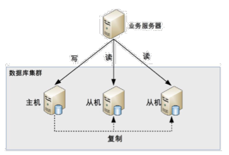

1. 数据库服务器搭建主从集群
2. 数据库主机负责读写业务, 从机只负责读操作
3. 数据库主机通过复制将数据同步到从机, 每台数据库服务器都存储了所有业务数据
4. 外部将写操作发送给数据库主机, 将读操作发送给从机

读写分离引入了两个复杂度:
### 4.1.1 复制延迟
> 如果业务服务器将数据写到主机后立刻访问从机, 次数主机还没有将数据复制过来, 从机没有该数据.

解决方案:
1. 写操作后的读操作指定发给主机
2. 读从机失败后再读一次主机
3. 关键业务读写操作全部指向主机, 非关键业务采用读写分离
### 4.1.2 分配机制
> 将读写操作区分开来, 然后访问不同的数据库服务器, 一般有两种方式: 程序代码封装和中间件封装
#### 1. 程序代码封装
将代码抽象一个数据访问层, 实现读写操作分离和书库服务连接的管理

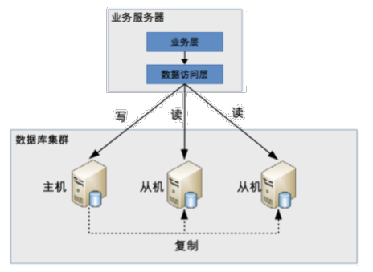

特点:
1. 实现简单, 可以根据业务定制化
2. 可重用性差, 每个语言都需要实现

#### 2. 中间件封装
> 独立出一套系统, 实现读写操作分离和数据库连接的管理, 中间件对业务服务提供 SQL 兼容的协议

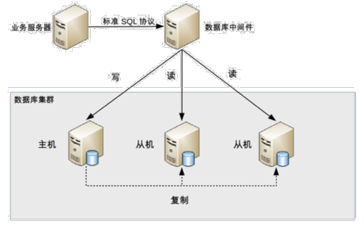

特点:
1. 支持多种语言, 因为中间件对业务服务器提供标准的 SQL 接口
2. 实现复杂, 需要支持完整的 SQL 语法和数据库服务器协议
3. 中间件自己不执行真正的读写操作, 但所有请求都要经过中间件
4. 数据库主从切换对业务无感知, 数据库中间件可以探测数据库服务器的主从状态

## 4.2 分库分表
### 4.2.1 分库
> 按照业务模块将数据分散到不同的数据库服务器
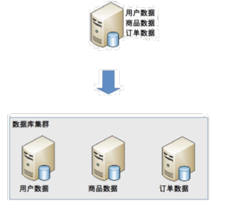

带来的问题: 
1. join 操作: 分库后, 原本在同一个数据库中的表分散到不同数据库中, 导致无法使用 join 操作
2. 事务问题: 无法通过事务统一修改
3. 成本问题: 分库的同时带来了成本的代价
### 4.2.2 分表
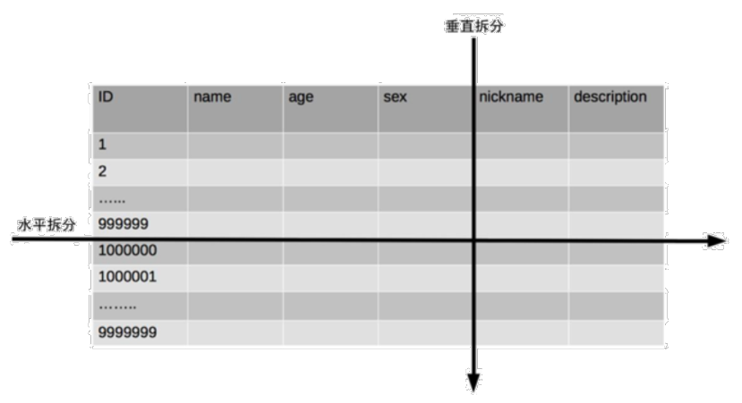

#### 1. 垂直拆分
可以把一张表切成记录总数相等, 但包含不同字段的多张表

适合将表中某些不太常用并且占了大量空间的列拆分出去
#### 2. 水平拆分
可以把一张表切分成拥有全部字段但只拥有一部分记录的多张表

适合切分行数很大的表, 一般超过 5000 万行记录就可以考虑拆分.

水平拆分引入的问题:
##### 1. 路由
水平分表后, 某条记录具体属于哪个切分后的子表, 需要增加路由算法进行计算, 这个算法会引入一定的复杂性
- 范围路由: 选取有序的数据列作为路由的条件, 不同分段分散到不同的数据库表中;
- hash 路由: 选取某些列的值 hash 运算, 然后根据结果分散到不同的表中;
- 配置路由: 用一张独立的表来记录路由信息.

##### 2. join 操作
需要业务代码或者数据库中间件进行多次 join, 然后将结果合并
##### 3. count() 操作
水平分表后, 虽然物理上的数据分散到多张表, 但某些业务逻辑上还是会将这些表当做一个表来处理;

将每张表进行 COUNT() 操作, 然后将结果相加;
##### 4. order by
只能由业务代码或者数据库中间件分别查询每个子表中的数据, 然后汇总进行排序

# 5. 高性能 NoSQL
关系型数据库存在的缺点:
- 关系型数据库存储的行记录, 无法存储数据结构
- 关系型数据库的 schema 扩展非常不方便
- 关系型数据库在大数据场景下 I/O 较高
- 关系型数据库的全文搜索功能比较弱

因此有了 NoSQL, 常见的 NoSQL 分为 4 类:
- K-V 存储: 解决关系型数据库无法存储数据结构的问题, 以 Redis 为代表
- 文档数据库: 解决关系型数据库强 schema 约束的问题, 以 MongoDB 为代表
- 列式数据库: 解决关系型数据大数据场景下 I/O 的问题, 以 HBase 为代表
- 全文搜索引擎: 解决关系型数据库全文搜索性能问题, 以 ElasticSearch 为代表.

## 5.1 K-V 存储

## 5.2 文档数据库
为了解决关系型数据库 schema 带来的问题, 文档数据库应运而生, 最大的特点就是 `no-schema`, 可以读写任意格式的数据, 目前绝大部分文档数据库存储的数据格式是 JSON( 或 BSON).

`no-schema` 所带来的优势:
1. 新增字段简单
2. 历史数据不会出错
3. 可以存储复杂数据

文档数据库 `no-schema` 特性带来的代价主要有不支持事务, 无法实现 `join` 操作

## 5.3 列式数据库
列式数据库就是按照列来存储数据的数据库.

关系型数据库按照行式来存储数据, 有以下几个优势:
1. 业务同时读取多个列时效率高, 因为这些列都是按行存储在一起的, 一次磁盘操作就能够把一行数据中各个列都读取到内存中;
2. 能够一次性完成对一行数据中多个列的写操作, 保证了针对数据写操作的原子性和一致性;

而在某些场景下, 行式存储并不占优势, 比如海量数据统计特定一项信息.

## 5.4 全文搜索引擎
传统的关系型数据库通过索引来达到快速查找的目的, 但在全文搜索的业务场景中, 很难发挥出作用, 主要体现在:
1. 全文搜索的天剑可以随意排列组合
2. 全文搜索的模糊匹配方式, 索引无法满足, like 的效率很低

全文搜索引擎通过建立 `倒排索引`, 保存每个分词的来源, 从而实现全文搜索

# 6. 高性能缓存架构
在某些单纯依靠存储系统体能提升不足的场景, 如
1. 需要经过复杂运算后得出的数据, 存储系统无能为力
2. 读多写少的数据, 存储系统有心无力

缓存就是为了弥补存储系统在这些复杂业务场景写的不足, 基本原理是将可能重复使用的数据放在缓存中, 避免每次都访问存储系统

下面来分析缓存所带来的复杂性:
## 6.1 缓存穿透
是指缓存没有发挥作用, 业务系统虽然去缓存查询数据, 但缓存中没有数据, 通常由下面两种情况
### 6.1.1 数据不存在
如果缓存不存在, 需要访问存储系统, 但如果存在黑客攻击, 故意大量访问某些读取不到的数据, 可能会将存储系统拖垮
解决方案:
1. 在某些业务场景中可以规定查询的规则, 不符合规则的查询条件直接在业务层返回
2. 如果存储系统查询不到, 直接在缓存中设置一个默认值
### 6.1.2 缓存数据生成需要耗费大量时间
可以提前预热分页数据
## 6.2 缓存雪崩
当缓存失效后, 引起的系统性能急剧下降的问题, 当缓存过期被清除后, 系统需要生成新的缓存, 可能同一时间有大量的请求都会去重新生成缓存
解决方案:
### 6.2.1 更新锁
对缓存的更新操作需要进行加锁保护, 保证只有一个线程能够进行缓存更新, 未能获取更新锁的线程要么等待要么返回空值
### 6.2.2 后台更新
由后台线程来更新缓存, 而不是由业务线程来更新缓存, 缓存本身的有效期设置为永久, 后台线程定时更新缓存.

后台更新机制还适合业务刚上线时进行缓存预热
## 6.3 缓存热点
虽然缓存系统本身性能比较高, 但对于一些特别热点的数据, 如果大部分甚至所有业务请求都命中同一份缓存数据, 那么这份数据在服务器中的压力也很大.

解决方案是复制多份副本, 将请求分散到多个缓存服务器上, 减轻缓存热点导致的额单台缓存服务器压力.

# 7. 高性能负载均衡

# 10. 互联网架构模板
互联网额标准技术架构如图所示

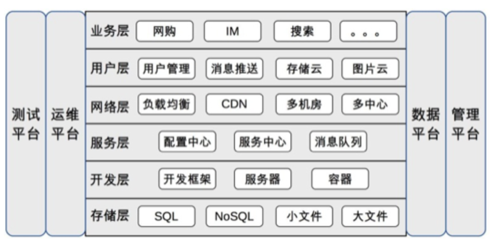

## 10.1 存储层
### 10.1.1 SQL
关系型数据库, 一般情况下互联网行业都是用 MySQL 这类开源数据库, 随着业务的发展, 必然要面对一个问题: 将数据拆分到多个数据库实例才能满足业务的性能需求;

数据库拆分满足了性能的要求, 但带来了复杂度的问题, 数据如何拆分, 如何组合?

在业务发展到了一定阶段后, 就会将这部分功能独立成中间件.

随着业务继续发展, SQL 服务器越来越多, 如果每个业务都基于统一的数据库中间件部署自己的 SQL 几区, 就会导致新的复杂度问题:
1. 数据库资源使用不高, 比较浪费
2. 各 SQL 集群分开维护, 成本较高

因此可以在 SQL 集群的基础上建立 SQL 存储平台, 以对业务透明的形式提供资源分配, 数据备份, 迁移, 容灾, 读写分离, 分库分表等一系列业务;

### 10.1.2 NoSQL
NoSQL 在数据结构上与传统的 SQL 不同, 并且都将性能作为自己的一大卖点
NoSQL 一般自己会提供集群方案, 如:
1. Redis 3.0 提供的 cluster 模式
2. MongoDB 分片

### 10.1.3 小文件存储
除了关系型的业务数据, 还有很多用于展示的数据, 一般具有如下特点:
1. 数据小, 一般不会超过 5M
2. 数据巨大
3. 访问量大

得益于开源运动的发展和近几年大数据的火爆, 在开原方案的基础上封装一个小文件存储平台并不是太难的事情, 例如 HBase, Hadoop, FastDFS 等都可以作为小文件存储的底层平台.

### 10.1.4 大文件存储
1. 业务上的大数据, 比如视频, 电影等
2. 海量的日志文件, 用户数据等

开原方案已经非常成熟, 大数据的存储和处理反而最简单, Hadoop, HBase, Storm, Hive 等

## 10.2 服务层
服务层额主要目标是为了降低系统间相互关联的复杂度
### 10.2.1 配置中心
> 集中管理各个系统的配置

当系统数量不多的时候, 一般都是各系统自己管理自己的配置, 但系统数量多了以后这样的操作就会出现问题:
1. 某个功能上线, 需要多个系统配合一起上线, 分散配置时, 配置检查, 沟通协调需要耗费较多时间;
2. 各系统自己管理配置的时候, 一般是通过文本编辑的方式修改的, 没有自动校验的机制, 容易配置错误.

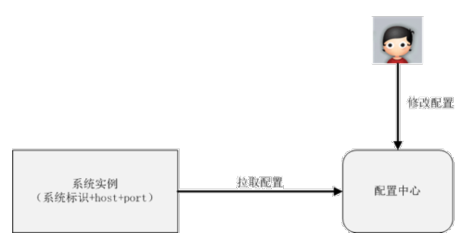

### 10.2.2 服务中心
当系统数量不多的时候, 系统间的调用一般都是直接通过配置文件记录在各系统内部, 但当系统数量多了以后, 这种方式就存在问题了.

服务中心就是为了解决跨系统依赖的 `配置` 和 `调度` 问题, 实现方式一般来说有两种: `服务名称系统` 和 `服务总线系统`
#### 1. 服务名称系统(Service Name System)

DNS 的作用将域名解析为 IP 地址, 主要是因为我们记不住太多的数字 IP, 域名就容易记住, 服务名称系统就是为了将 Service 名称解析为 `host + port + 接口名称`, 但是和 DNS 一样, 真正发起请求的还是调用方

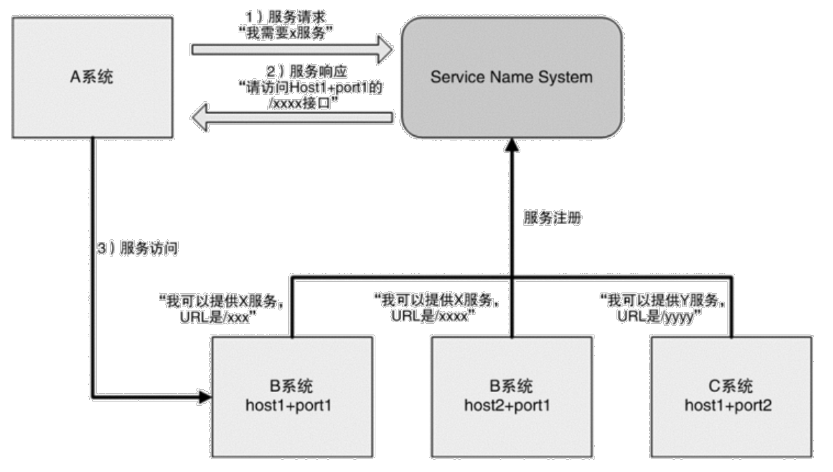

#### 2. 服务总线系统(Service Bus System)
相比服务名称服务, 服务总线服务更进一步, 由总线系统完成调度, 服务请求方都不需要直接和服务提供方交互了

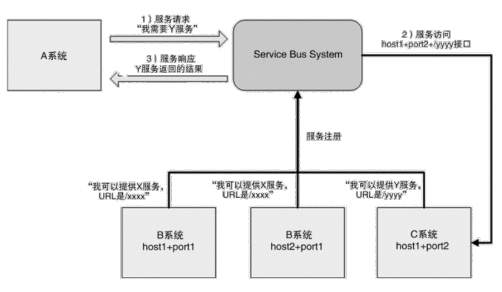

### 10.2.3 消息队列
传统的异步通知方式是由消息生产者直接调用消息消费者提供的接口进行通知

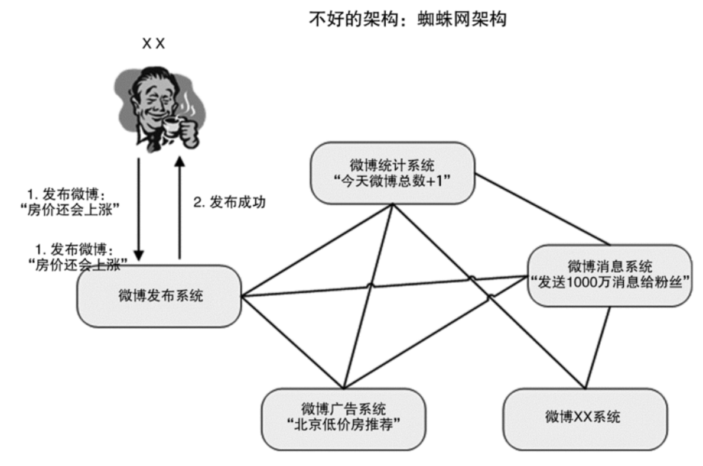

消息队列是为了实现这种跨系统异步通知的中间件系统, 消息队列既可以 `一对一` 通知, 也可以 `一对多广播`

对比前面的蜘蛛网架构, 可以清晰地看出引入消息队列系统后的效果
1. 整体结构从网状变为线性结构, 更加清晰
2. 消息生产者和消费者解耦, 实现简单
3. 增加新的消息消费者, 消息生产者完全不需要任何改动, 扩展方便
4. 消息队列可以做高可用, 高性能, 避免各业务子系统独立做一套

## 10.3 网络层
### 10.3.1 负载均衡
将请求均匀地分配到多个系统上
#### 1. DNS
最简单也是最常见的负载均衡方式, 一般用来实现地理级别的均衡

其优点是通用, 成本低, 而缺点也很明显:
1. 缓存时间较长
2. 不够灵活, DNS 不能感知后端服务器的状态, 只能根据配置策略进行负载均衡, 无法做到更加灵活的负载均衡策略.

#### 2. Nginx, LVS, F5
DNS 用于实现地理位置级别额负载均衡, Nginx 用于同一地点内机器级别的负载均衡

其中 Nginx 是软件的 7 层负载均衡, LVS 是内核的 4 层负载均衡

4 层和 7 层的区别就在于协议和灵活性, Nginx 支持 HTTP, E-mail 协议, 而 LVS 和协议无关, 几乎所有应用都可以做

#### 3. CND
是为了解决用户网络访问时 `最后一公里` 效应, 本质上是一种 `空间换时间` 的加速策略, 即将内容缓存在离用户最近的地方, 用户访问的是缓存内容, 而不是站点实时内容

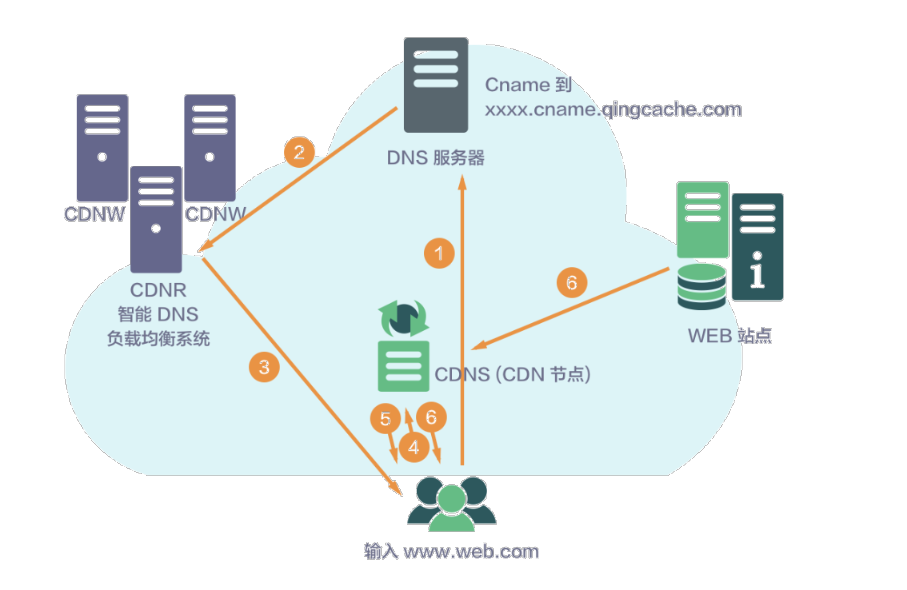

CDN 经过多年的发展, 已经变成了一个很庞大的体系, 分布式存储, 全局负载均衡, 网络重定向等等.

#### 4. 多机房
> 多机房设计最核心的因素就是如何处理延时带来的影响

##### 1. 同城多机房
同一个城市, 距离不会太远, 可以投入重金, 搭建私有高速网络通道, 基本能够做到和同机房一样的效果.

##### 2. 跨城多机房
在不同城市搭建多个机房, 机房间通过网络进行数据复制, 但由于跨城网络时延问题, 业务上需要一定的妥协, 比如不需要数据的实时强一致性

##### 3. 跨国多机房
在地理上分布更远, 时延更大, 由于时延太大, 一般仅用于备份和服务本国用户

#### 5. 多中心
多中心以多机房为前提, 但从设计角度上讲, 多中心相比多机房是本质上的飞跃, 难度也高处一个等级.

多机房的主要目标是备灾, 当机房故障时吗可以比较快速地将业务切换到另外一个机房, 这种切换允许一定时间的中断.

多中心的要求就高多了, 要求每个中心都同时对外提供服务, 并且业务能在多中心之间自由切换.

