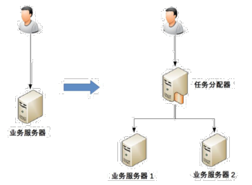
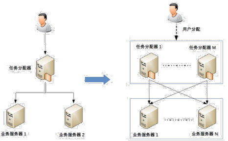
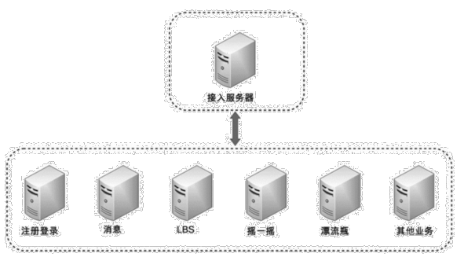
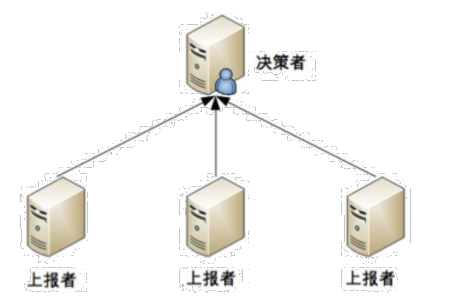
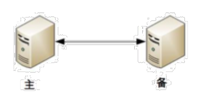
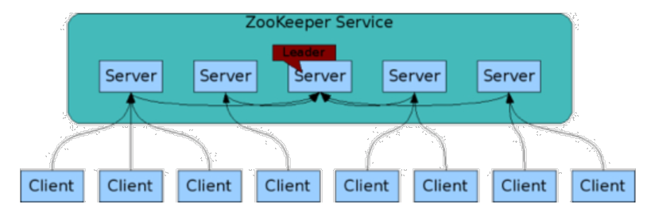
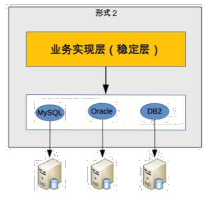
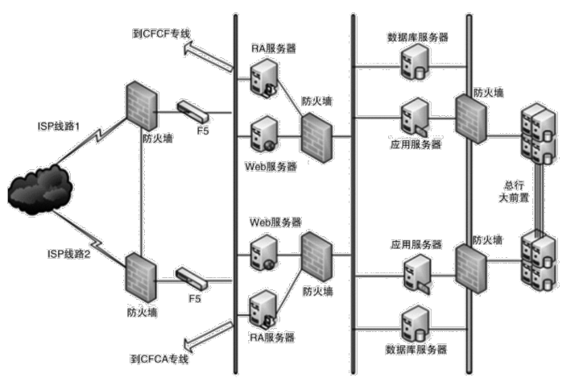

# 1. 架构设计的复杂度
## 1.1 高性能
软件系统中, 高性能带来的复杂度主要体现在两方面:
- 单机内部高性能的复杂度
- 集群之间高性能的复杂度

### 1.1.1 单机复杂度
操作系统的复杂度直接决定了软件系统的复杂度

操作系统和性能最相关的就是进程和线程:
- 进程用来对应一个任务, 每个人物都有自己独立的内存空间, 进程间互不相关, 由操作系统来进行调度, 操作系统把 CPU 分成多个时间片, 每个时间片只能执行某个进程中的指令, 为了让进程能够相互通信, 可以使用管道, 消息队列, 信号量, 共享存储等;  
- 多进程让多个任务能够并行处理, 但自身还有缺点, 单个进程内部只能串行处理, 而实际上很多进程内部的子任务并不要求严格按照时间顺序执行, 也需要并行处理, 因此发明了线程, 操作系统调度的最小单位变成了线程, 而进程变成了操作系统分配资源的最小单位.

### 1.1.2 集群复杂度
通过大量机器来提升性能, 并不仅仅是增加机器这么简单, 让多台机器配合完成高性能, 是一个复杂的任务.

#### 1. 任务分配
> 每台机器都可以处理完整的任务, 不同的任务分配到不同的机器上执行

在 1 台服务器变为 2 台之后, 新引入的问题:
1. 需要新增一个任务分配器, 可能是硬件网络设备(F5, 交换机), 可能是软件网络设备(LVS), 也可能是负载均衡软件(Nginx);
2. 任务分配器和真正的业务服务器之间对连接的管理, 比如连接建立, 连接管理, 异常中断后如何处理等;
3. 任务分配器需要增加分配算法, 轮询, 加权等

如果对性能的要求更进一步, 单台任务分配器可能会成为瓶颈, 因此就需要多台任务分配器

此时架构的复杂性体现在:
1. 任务分配器由 1 台变为多台, 需要将不同用户分配到不同任务分配器上, 常见方法包括 DNS 轮询, CDN 等
2. 任务分配器和业务服务器的关系从 `一对多` 变成了 `多对多`
3. 随着节点数量的增加, 状态管理, 故障处理复杂度也增加

#### 2. 任务分解
通过任务分配的方式, 能够突破单台机器的瓶颈, 但如果任务本身很复杂, 单纯只通过任务分配的方式来扩展性能存在瓶颈, 因此需要考虑任务分解

通过这种任务分解的方式, 能够把原来统一但复杂的业务拆分成小而简但需要多个系统配合的业务系统.

任务分解可以提升性能的原因:
1. 简单的系统更容易做到高性能, 功能越简单, 影响性能的点就越少, 就更容易进行针对性的优化.
2. 可以针对单个子任务进行扩展, 只需要针对有瓶颈的子系统进行优化

## 1.2 高可用

> 系统无中断地执行其功能的能力, 代表系统的可用程度, 是进行系统设计的准则之一.

硬件和软件本质上都无法做到 `无中断`, 在架构设计上, 本质都是通过 `冗余` 来实现高可用.

    高性能通过增加节点扩展处理能力, 高可用通过增加节点冗余处理单元
    

### 1.2.1 计算高可用
> 计算的特点: 无论在那台机器上进行, 相同的算法和输入数据, 产出的结果都一样

### 1.2.2 存储高可用
> 存储的特点: 将数据从一台机器搬到另一台机器, 需要经过线路进行传输  
数据 + 逻辑 = 业务  
业务如果需要保持一致, 不同节点上的逻辑和数据必须一致

存储高可用的难点不在于如何备份数据, 而是在于如何减少或者规避不一致对业务造成的影响.

### 1.2.3 高可用状态决策
系统需要能够判断当前节点的状态是正常还是异常, 如果出现了异常就要采取行动来保证高可用

#### 1. 独裁式

> 存在一个独立的主体, 负责收集信息并完成决策

此模式不存在决策混乱, 但因为只有一个决策者, 如果决策者本身发生故障, 整个系统就无法实现准确的状态决策.

#### 2. 协商式

> 2 个独立的个体通过交流信息, 根据规则进行决策, 最常见的就是主备决策
- 2 个节点启动时都是备机
- 2 个节点建立连接, 并交换状态信息
- 某个节点作出决策, 成为主机, 另一个节点继续保持备机身份

协商式决策存在的问题:
1. 备机在连接中断的情况下认为主机故障, 自身升级为主机, 但实际上此时主机并没有故障, 出现 2 台主机
2. 备机在连接中断的情况下不认为主机故障, 此时主机故障

#### 3. 选举式

> 多个独立的节点通过投票的方式进行状态决策

每个个体做出自己的决策, 然后按照多数通过的规则来确定最终的状态

选举式决策有一个天生的问题: `脑裂`, 当发生网络分区时, 集群被割裂成多数派和少数派, 都无法和外界联系, 从而认为对方节点下线, 自身集群内部进行决策.
此时一般采用 `投票节点必须超过系统总节点半数` 的规则来处理.

## 1.3 可扩展性
> 可扩展性是指为了应对将来需求变化而提供的一种扩展能力, 当新需求出现时, 现有系统仅需少量变动就可支持

设计良好扩展性的系统, 有两个基本条件:
- 正确预测变化
- 完美封装变化

### 1.3.1 预测变化
预测变化的复杂性在于:
- 不能每个设计点都考虑可扩展性
- 不能完全不考虑可扩展性
- 所有的预测都存在出错的可能

### 1.3.2 封装变化
#### 1. 将变化封装在变化层, 将不变部分封装在独立的稳定层

通过玻璃变化层和稳定层, 会带来如下复杂度问题:
- 系统需要拆分出变化层和稳定层
- 需要设计变化层和稳定层之间的接口

## 1.4 低成本, 安全, 规模
### 1.4.1 低成本
如果架构方案设计一定规模的服务器, 成本就会变成一个非常重要的架构设计考虑点.

低成本给架构设计带来的复杂度主要体现在: 往往只有 `创新` 才能达到低成本目标, 比如引入新的技术:
- NoSQL 的出现就是为了解决关系型数据库无法应对高并发访问带来的访问压力
- 全文搜索引擎 的出现就是为了解决关系型数据库 like 搜索的低效问题
- Hadoop 的出现是为了解决传统文件系统无法应对海量数据存储和计算的问题

### 1.4.2 安全
#### 1. 功能安全
如 CSRF 攻击, SQL 注入等

现在很多开发框架都内嵌的常见的安全功能, 比如 MyBatis 防止 SQL 注入等, 也需要作为架构设计的一环去考虑

#### 2. 架构安全
传统的架构安全主要依靠防火墙, 防火墙最基本的功能就是网络隔离, 通过将网络划分成不同区域, 制定出不同区域之间的访问控制策略来控制不同欣喜程度区域间传送的数据流.

### 1.4.3 规模
规模带来的复杂度的主要原因是 `量变引起质变`, 当数量超过一定的阈值之后, 复杂度会发生质变
- 功能越来越多, 导致系统复杂度指数级上升
- 数据越来越多, 系统复杂度发生质变

