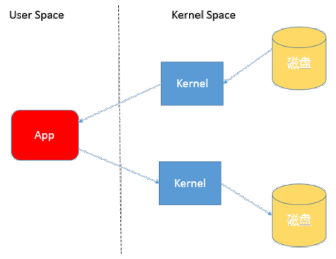
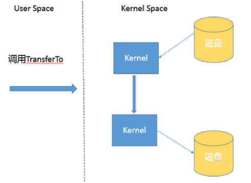

# 1. 经典的文件复制方式

> 利用 java.io 类库, 直接为源文件构建一个 FileInputStream 读取, 然后再为目标文件构建一个 FileOutputStream, 完成写入工作

```java
public static void copyFileByStream(File source, File dest) throws IOException {
    try (InputStream is = new FileInputStream(source);
         OutputStream os = new OutputStream(dest)) {
        byte[] buffer = new byte[1024];
        int length;
        while((length = is.read(buffer)) > 0) {
            os.write(buffer, 0, length);
        }
    }
}
```

# 2. 利用 java.nio 类库
```java
public static void cppyFileByChannel(File source, File dest) throws IOException {
    try (FileChannel sourceChannel = new FileInputStream(source).getChannel();
         FileChannel targetChannel = new FileOutputStream(dest).getChannel()) {
        for (long count = sourceChannel.size(); count > 0; ) {
            long transfered = sourceChannel.transferTo(sourceChannel.position(), count, targetChannel);
            count -= transferred;
        }
    }
}
```

总体上说, NIO transferTo/From 的效率会更高一些, 因为它更能利用现代操作系统底层机制, 避免不必要的拷贝和上下文切换.

# 3. 扩展
## 3.1 拷贝实现机制
- 内核态空间: 操作系统内核, 硬件驱动等运行在内核
- 用户态空间: 给普通应用和服务使用

当我们使用第一种方式进行读写的时候, 实际上是进行了多次上下文切换, 比如应用读取数据的时候, 现在内核态将数据从磁盘读取到内核缓存, 再切换到用户态从内核缓存读取到用户缓存, 写入的步骤类似, 仅仅是步骤相反.



所以, 这种方式会带来一定的额外开销吗可能会降低 IO 效率.

而基于 NIO transferTo 的实现方式, 在 Linux 和 Unix 上, 则会使用到 `零拷贝技术`, 数据传输并不需要用户态参与, 省去了上下文切换和不必要的内存拷贝, 进而可能提高应用拷贝性能.

    transferTo 不仅可以用在文件拷贝中, 与其类似的读取磁盘文件然后进行 socket 发送同样可以先手这种机制带来的性能和扩展提高.
    


## 3.2 掌握 NIO Buffer
| 字段 | 含义 |
| :-: | :-: |
| capacity | 表示这个 Buffer 到底有多大, 也就是数组的长度 |
| position | 要操作的数据的起始位置 |
| limit | 相当于操作的限额, 在读取或者写入中, limit 的意义很明显是不一样的, 比如 读取操作时, 可能将 limit 设置到容纳数据的上限,<br/> 而在写入时, 则会设置容量或容量以下的可写限度.
| mark | 记录上一次 position 的位置, 默认是 0, 算是一个便利性的考虑, 往往不是必须的

Buffer 的基本操作:
1. 创建一个 ByteBuffer, 准备放入数据, `capacity` 就是缓冲区的大小, 而 `position` 就是 0, `limit` 默认就是 `capacity` 的大小;
2. 当我们写入几个字节的数据时, `position` 就会跟着增加, 但它不可能超过 `limit`  的大小;
3. 如果我们想把之前的数据读出来, 需要调用 `filp() 方法`, 将 `position` 设置为 0, limit 设置为以前的 `position`;
4. 如果需要再读, 可以调用 `rewind()`, 让 `limit` 不变, `position` 再次设置为 0;

Direct Buffer: 实现了堆外内存, 