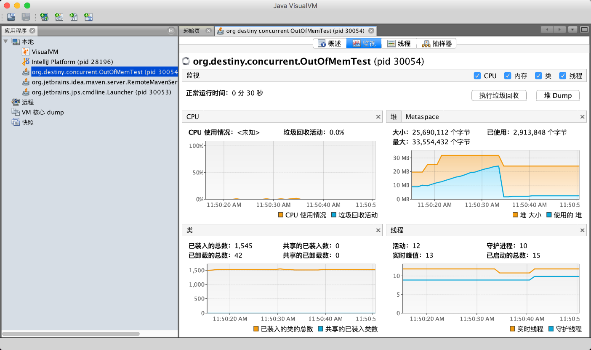

> 在多线程环境下，每个线程拥有一个栈和一个程序计数器。栈和程序计数器用来保存线程的执行历史和线程的执行状态，是线程私有的资源。其他的资源（比如堆、地址空间、全局变量）是由同一个进程内的多个线程共享。

首先可以写一个测试代码:

```java
public class OutOfMemTest {

    public static void main(String[] args) {
        /*
         * 第一个线程, 用来实现 OOM 场景, 每秒分配 1M 内存
         * 同时为了方便观察, 使用 '==' 作为输出的开头
         */
        new Thread(() -> {
            List<byte[]> mem = new ArrayList<>();
            while (true) {
                System.out.println("== " + new Date().toString() + " : " + Thread.currentThread());
                byte[] bytes = new byte[1024 * 1024];
                mem.add(bytes);

                try {
                    Thread.sleep(1000);
                } catch (InterruptedException e) {
                    e.printStackTrace();
                }
            }
        }
        ).start();

        /*
         * 第二个线程, 不做任何操作, 只测试在 OOM 发生时是否能够正常执行
         * 同时为了方便观察, 使用 '--' 作为输出的开头
         */
        new Thread(() -> {
            while (true) {
                System.out.println("-- " + new Date().toString() + " : " + Thread.currentThread());
                try {
                    Thread.sleep(1000);
                } catch (InterruptedException e) {
                    e.printStackTrace();
                }
            }
        }).start();
    }
}
```

同时设置 JVM 启动参数

```
-Xms16m -Xmx32m     # 初始大小 16M, 最大 32M
```

观察此时的控制台信息:

    == Tue Oct 02 11:50:10 CST 2018 : Thread[Thread-0,5,main]
    -- Tue Oct 02 11:50:10 CST 2018 : Thread[Thread-1,5,main]
    == Tue Oct 02 11:50:11 CST 2018 : Thread[Thread-0,5,main]
    -- Tue Oct 02 11:50:11 CST 2018 : Thread[Thread-1,5,main]
    -- Tue Oct 02 11:50:12 CST 2018 : Thread[Thread-1,5,main]
    == Tue Oct 02 11:50:12 CST 2018 : Thread[Thread-0,5,main]
    -- Tue Oct 02 11:50:13 CST 2018 : Thread[Thread-1,5,main]
    == Tue Oct 02 11:50:13 CST 2018 : Thread[Thread-0,5,main]
    -- Tue Oct 02 11:50:14 CST 2018 : Thread[Thread-1,5,main]
    == Tue Oct 02 11:50:14 CST 2018 : Thread[Thread-0,5,main]
    -- Tue Oct 02 11:50:15 CST 2018 : Thread[Thread-1,5,main]
    == Tue Oct 02 11:50:15 CST 2018 : Thread[Thread-0,5,main]
    -- Tue Oct 02 11:50:16 CST 2018 : Thread[Thread-1,5,main]
    == Tue Oct 02 11:50:16 CST 2018 : Thread[Thread-0,5,main]
    == Tue Oct 02 11:50:17 CST 2018 : Thread[Thread-0,5,main]
    -- Tue Oct 02 11:50:17 CST 2018 : Thread[Thread-1,5,main]
    -- Tue Oct 02 11:50:18 CST 2018 : Thread[Thread-1,5,main]
    == Tue Oct 02 11:50:18 CST 2018 : Thread[Thread-0,5,main]
    -- Tue Oct 02 11:50:19 CST 2018 : Thread[Thread-1,5,main]
    == Tue Oct 02 11:50:19 CST 2018 : Thread[Thread-0,5,main]
    -- Tue Oct 02 11:50:20 CST 2018 : Thread[Thread-1,5,main]
    == Tue Oct 02 11:50:20 CST 2018 : Thread[Thread-0,5,main]
    -- Tue Oct 02 11:50:21 CST 2018 : Thread[Thread-1,5,main]
    == Tue Oct 02 11:50:21 CST 2018 : Thread[Thread-0,5,main]
    -- Tue Oct 02 11:50:22 CST 2018 : Thread[Thread-1,5,main]
    == Tue Oct 02 11:50:22 CST 2018 : Thread[Thread-0,5,main]
    -- Tue Oct 02 11:50:23 CST 2018 : Thread[Thread-1,5,main]
    == Tue Oct 02 11:50:23 CST 2018 : Thread[Thread-0,5,main]
    -- Tue Oct 02 11:50:24 CST 2018 : Thread[Thread-1,5,main]
    == Tue Oct 02 11:50:24 CST 2018 : Thread[Thread-0,5,main]
    -- Tue Oct 02 11:50:25 CST 2018 : Thread[Thread-1,5,main]
    == Tue Oct 02 11:50:25 CST 2018 : Thread[Thread-0,5,main]
    -- Tue Oct 02 11:50:26 CST 2018 : Thread[Thread-1,5,main]
    == Tue Oct 02 11:50:26 CST 2018 : Thread[Thread-0,5,main]
    -- Tue Oct 02 11:50:27 CST 2018 : Thread[Thread-1,5,main]
    == Tue Oct 02 11:50:27 CST 2018 : Thread[Thread-0,5,main]
    -- Tue Oct 02 11:50:28 CST 2018 : Thread[Thread-1,5,main]
    == Tue Oct 02 11:50:28 CST 2018 : Thread[Thread-0,5,main]
    -- Tue Oct 02 11:50:29 CST 2018 : Thread[Thread-1,5,main]
    == Tue Oct 02 11:50:29 CST 2018 : Thread[Thread-0,5,main]
    -- Tue Oct 02 11:50:30 CST 2018 : Thread[Thread-1,5,main]
    == Tue Oct 02 11:50:30 CST 2018 : Thread[Thread-0,5,main]
    -- Tue Oct 02 11:50:31 CST 2018 : Thread[Thread-1,5,main]
    == Tue Oct 02 11:50:31 CST 2018 : Thread[Thread-0,5,main]
    -- Tue Oct 02 11:50:32 CST 2018 : Thread[Thread-1,5,main]
    == Tue Oct 02 11:50:32 CST 2018 : Thread[Thread-0,5,main]
    -- Tue Oct 02 11:50:33 CST 2018 : Thread[Thread-1,5,main]
    == Tue Oct 02 11:50:33 CST 2018 : Thread[Thread-0,5,main]
    Exception in thread "Thread-0" java.lang.OutOfMemoryError: Java heap space
    	at org.destiny.concurrent.OutOfMemTest.lambda$main$0(OutOfMemTest.java:30)
    	at org.destiny.concurrent.OutOfMemTest$$Lambda$1/764977973.run(Unknown Source)
    	at java.lang.Thread.run(Thread.java:745)
    -- Tue Oct 02 11:50:34 CST 2018 : Thread[Thread-1,5,main]
    -- Tue Oct 02 11:50:35 CST 2018 : Thread[Thread-1,5,main]
    -- Tue Oct 02 11:50:36 CST 2018 : Thread[Thread-1,5,main]
    -- Tue Oct 02 11:50:37 CST 2018 : Thread[Thread-1,5,main]
    -- Tue Oct 02 11:50:38 CST 2018 : Thread[Thread-1,5,main]
    -- Tue Oct 02 11:50:39 CST 2018 : Thread[Thread-1,5,main]
    -- Tue Oct 02 11:50:40 CST 2018 : Thread[Thread-1,5,main]
    
在 `11:50:34` 时, `Thread[Thread-0,5,main]` 抛出了 OOM, 但后面 `Thread[Thread-1,5,main]` 仍然在运行.  
使用 `jvisualvm` 工具观察堆的内存占用情况: 



可以看到在 11:50:30 ~ 11:50:40 之间, 即在同样的时间, 堆的已使用内存出现了断崖式下降, 这代表着当一个线程抛出 OOM 异常的时候, 该线程会停止执行, 同时所占用的内存会被回收, 因此如果其他线程的内存分配没有被影响, 那么其他线程的运行也不会被影响.