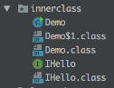

# 1. 例子
```java
public interface IHello {
    void say(String name);
}

public class Demo {

    public void run() {
        final String myName = "destiny";
        IHello hello = new IHello() {
            @Override
            public void say() {
                System.out.println("hello " + myName);
            }
        };
        hello.say();
    }

    public static void main(String[] args) {
        Demo demo = new Demo();
        demo.run();
    }
}
```

示例由两个文件组成, 分别是接口类 `IHello` 和使用了匿名内部类的 `Demo`.

首先执行

```bash
javac *.java
```

将源码进行编译, 得到的目录如下:



可以看到, 编译生成了三个 class 文件, 其中两个很容易理解, 但 `Demo$1.class`, 是在编译阶段, 由编译器以内部类的形式自动 implement 该接口产生的类.

# 2. 为什么需要加 final
通过 

```bash
javap -verbose Demo.class
```

查看 `Demo$1.class` 的结果:

```java
class Demo$1 implements IHello {
    Demo$1(Demo var1, String var2) {
        this.this$0 = var1;
        this.val$myName = var2;
    }

    public void say() {
        System.out.println("hello " + this.val$myName);
    }
}
```

此处可以清晰的看到, 又编译器自动生成的内部类持有外部类以及局部变量的引用, 且会通过构造方法的形式完成初始化.

从源码的角度看, 的确是同一个变量, 但在字节码的角度来看, 其实不是同一个变量.

如果不加 final, 则会出现在内部类修改了该变量, 但内部类执行完该变量的改动不会被外部类所感知到, 因此通过 final 的形式避免对该变量的修改.