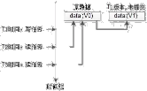
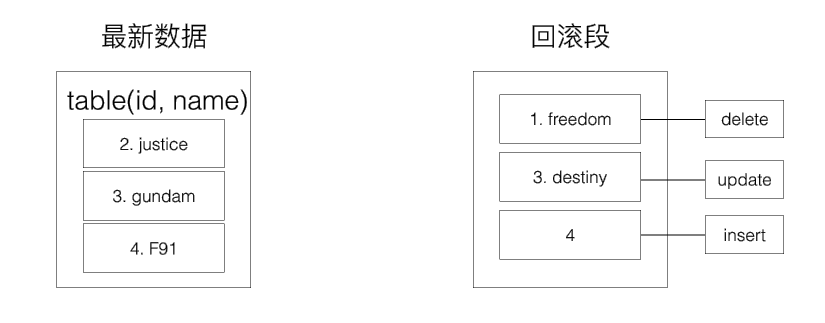
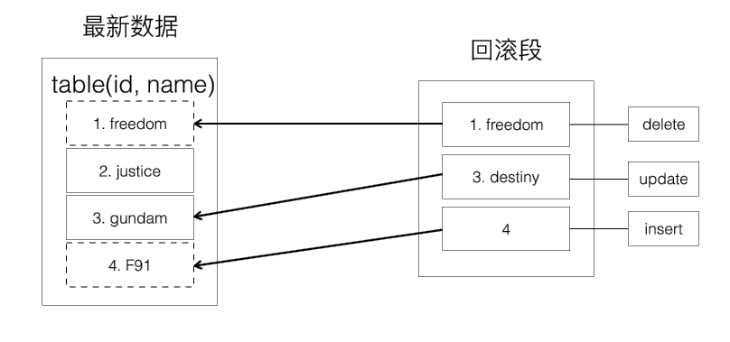

# 1. 并发控制
> 并发的任务对同一个临界资源记性操作, 如果不采取措施, 可能导致不一致, 因此需要采取并发控制(Concurrency Control)

通过并发控制保证数据一致性的实现方式:
1. 锁(Locking)
2. 数据多版本(Multi Version)

## 2.1 锁
加锁过程:
1. 操作数据前, 给记录加上锁, 试试互斥, 不允许其他事务进行任何操作
2. 由加锁的事务完成操作
3. 操作完成, 释放锁, 让其他事务执行

但由于互斥锁性能太低, 连读任务也无法并行, 事务执行的过程本质上是串行的.

因此出现了 `共享锁` 和 `排他锁` 
- 共享锁(`Shear Lock`), 读取数据时加 S 锁
- 排他锁(`Exclusive Lock`), 修改数据是加 X 锁

共享锁与排他锁的关系:
- 共享锁之间不互斥, 也就是读读可以并行
- 排他锁与任何锁都互斥, 读写, 写读, 写写不能并行

## 2.2 数据多版本
数据多版本是一种能够进一步提高并发的方法, 它的核心原理是:
1. 写任务发生时, 将数据克隆一份, 以版本号区分; 
2. 写任务操作新克隆的数据, 直至提交;
3. 并发读任务可以继续读取旧版本的数据, 不至于阻塞.



操作过程:
1. 最开始数据的版本是`V0`;
2. T1时刻发起了一个写任务, 这是把数据 clone 了一份, 进行修改, 版本变为V1, 但任务还未完成;
3. T2时刻并发了一个读任务, 依然可以读`V0`版本的数据;
4. T3时刻又并发了一个读任务, 依然不会阻塞;

# 3. Redo, Undo, 回滚段
## 3.1 Redo Log
数据库事务提交之后 必须将其更新后的数据刷新到磁盘, 以保证 ACID 特性, 磁盘随机写性能比较低, 如果每次都刷盘, 会极大影响数据库的吞吐量

优化方式是将修改行为先写到 Redo Log 中, (此时变成了顺序写), 再定期将数据刷到磁盘上, 这样能极大提高性能.

假如某一时刻, 数据库崩溃, 还没来得及刷盘的数据, 在数据库重启后, 会重做 Redo Log 日志中的内容, 以保证提交的事务一定会刷盘.

> Redo Log 用于保障已提交事务的 ACID 特性

## 3.2 Undo Log
数据库事务未提交时, 会将事务修改数据的镜像(即修改前的旧版本)存放到 `undo` 日志里, 当事务回滚时, 或者数据库奔溃时, 可以利用undo日志, 即旧版本数据, 撤销未提交事务对数据库产生的影响.

当事务回滚或者数据库崩溃, 可以利用 undo 日志, 撤销未提交的事务对数据库产生的影响

    对于 INSERT 操作, undo log 记录新数据的主键, 回滚时直接删除
    对于 UPDATE/DELETE 操作, undo log 记录旧数据的 row, 回滚时直接恢复
    他们分别存放在不同的 buffer 中
    
> undo log 用于保障未提交的事务不会对数据库的 ACID 特性产生影响

## 3.3 回滚段
> 存储 undo log 的地方被称为回滚段, undo log 和回滚段和 `InnoDB` 的 `MVCC` 密切相关

假设有下面表: 
```sql
table(id primary key, name);
```
数据为:

    (1, 'freedom')
    (2, 'justice')
    (3, 'destiny')
    
#### 此时没有事务提交, 因此回滚段是空的


然后启动一个事务

```sql
START TRANSACTION
DELETE (1, 'freedom');
UPDATE table SET name = 'gundam' WHERE id = 3;
INSERT INTO table VALUES (4, 'F91');
```

并且目前事务处于未提交状态

#### 此时的回滚段:



1. 被删除前的 `(1, 'freedom')` 作为旧版本数据, 进入了回滚段;
2. 被修改前的 `(3, destiny)` 作为旧版本数据, 进入了回滚段;
3. 被插入的数据, `PK(4)` 进入了回滚段;

#### 接下来, 假如事务 `rollback`, 此时可以通过回滚段里的 undo log 回滚



可以看到:
1. 被删除的旧数据恢复了;
2. 被修改的旧数据也恢复了;
3. 被插入的数据，删除了;

#### 事务如果提交


事务提交成功, 回滚段中的 undo log 可以删除

# 4. InnoDB 是基于多版本并发控制的存储引擎

> InnoDB 是高并发互联网场景最为推荐的存储引擎, 根本原因, 就是其多版本并发控制 `Multi Version Concurrency Control, MVCC`.   
行锁, 并发, 事务回滚等多种特性都和 `MVCC` 相关.  
MVCC 就是通过 `读取旧版本数据` 来降低并发事务的锁冲突, 提高任务的并发度.

旧版本数据存在与回滚段中, 并且对 InnoDB 原有架构体系冲击不大

InnoDB 内核会对所有 row 数据增加三个内部属性:
1. DB_TRX_ID, 6 字节, 记录每一行最近一次修改它的事务 id;
2. DB_ROLL_PTR, 7 字节, 记录指向回滚段的 undo log 日志的指针;
3. DB_ROW_ID, 6 字节, 单调递增的行 id.

> InnoDB 为何能够做到高并发

回滚段里的数据, 其实是历史数据的快照, 这些数据是不会被修改的, SELECT 可以毫无顾忌的读取

快照读 `(Snapshot Read)`, 这种一致性不加锁的读`(Consistent Nonlocking Read)`, 就是 InnoDB 能够做到高并发的原因之一.

这里的一致性是指, 事务读取到的数据, 要么是事务开始前就已经存在的数据, (当然，是其他已提交事务产生的), 要么是事务自身插入或者修改的数据.

> 什么样的 SELECT 是快照读?

除非显式加锁, 普通的 SELECT 都是快照读

例如:

```sql
SELECT * FROM tb WHERE id = 3;
```

这里的 `显式加速`, `非快照读` 指的是:
```sql
SELECT * FROM tb WHERE id = 3 LOCK IN SHARE MODE ;
SELECT * FROM tb WHERE id = 3 FOR UPDATE ;
```