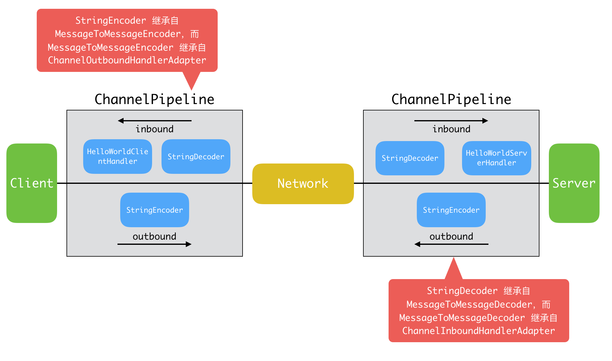
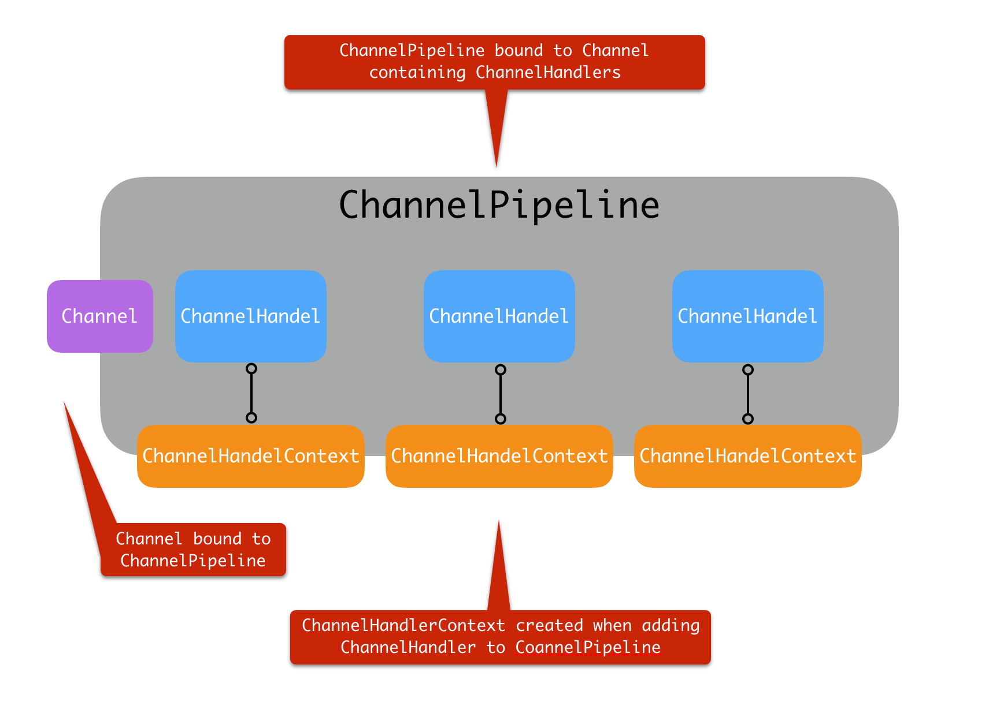
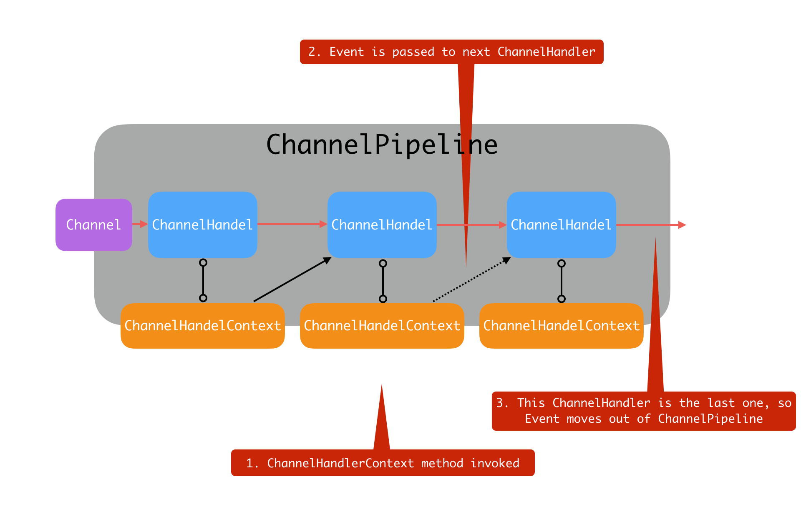

# 1. Netty 如何实现高性能

    Netty 在基础的 NIO 之上, 进行了许多改进
    
1. 更加优雅的 Reactor 模式实现, 更加灵活的线程模型, 利用 EventLoop 等创新性机制, 可以非常高效地管理大量 Channel.
2. 充分利用了 Java 的 `Zero-Copy` 机制, 并且从多种角度降低内存分配和回收的开销:  
使用池化的 `Direct Buffer` 等技术, 在提高 IO 性能的同时, 减少了对象创建和销毁;  
利用反射等技术直接操作 SelectionKey;  
使用数组而不是 Java Collection 等.
3. 使用更多的本地代码. 例如直接利用 JNI 调用 OpenSSL 等方式, 获得比 Java 内建 SSL 引擎更好的性能.
4. 在通信协议, 序列化等角度也进行了优化

# 2. Netty 核心概念

|  核心概念 | 描述 |
| --- | --- |
| ServerBootstrap | 服务器端程序的入口, 这是 Netty 为佳话网络程序配置和关闭等生命周期管理, 所引入的 Bootstrapping 机制. 通常需要做的创建 Channel, 绑定端口, 注册 Handler 等, 都可以通过这个统一的入口完成.
| Channel | 基于 NIO 的扩展框架, Channel 和 Selector 等概念仍然是 Netty 的基础组建, 但是针对应用开发具体需求, 提供了相对易用的抽象.
| EventLoop | Netty 处理事件的核心机制. 注册感兴趣的事件, 调度响应的 Handler 等, 都是通过 EventLoop 完成的
| ChannelFuture | Netty 实现异步 IO 的基础之一, 保证了同一个 Channel 操作的调用顺序, Netty 扩展了 Java 标准的 Future, 提供了很对自己场景特有的 Future 定义
| ChannelHandler | 应用开发者放置业务逻辑的地方
| ChannelPipeline | 是 ChannelHandler 链条的容器, 每个 Channel 在创建后, 自动被分配一个 ChannelPipeline

