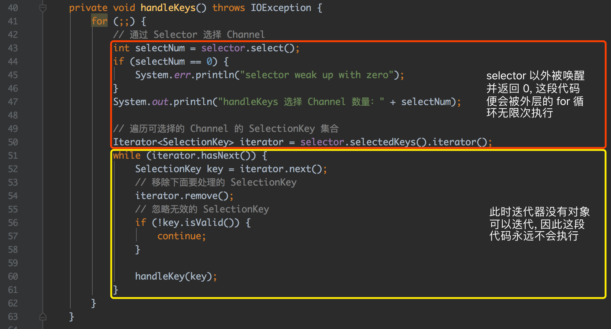

# 问题原因

> 在 NIO 的selector中, 即使是关注的select轮询事件的key为0的话, NIO 照样不断的从 select 本应该阻塞的情况中 `wake up` 出来

若 Selector 的轮询结果为空，也没有 wakeup 或新消息处理，则发生空轮询，CPU使用率100%.

# Netty 解决方案
1. 对 Selector 的 select 操作周期进行统计, 每完成一次空的 select 操作进行一次计数;
2. 若在某个周期内连续发生 `N` 次空轮询, 则触发了 `epoll` 死循环 bug;
3. 重建 Selector, 判断是否是其他线程发起的重建请求, 若不是则将原 SocketChannel 从旧的 Selector 上去除注册, 重新注册到新的 Selector 上, 并将原来的 Selector 关闭

因为 selector 的 select 方法返回值是 0, 所以下面本应该对 key 值进行遍历的事件处理根本执行不了, 又回到最上面的 `for(;;)` 循环, 循环往复, 不断的轮询, 直到linux系统出现100%的CPU情况, 其它执行任务干不了活.

在 (JDK-6403933 : (se) Selector doesn't block on Selector.select(timeout) (lnx))[https://bugs.java.com/bugdatabase/view_bug.do?bug_id=6403933] 中, 提到了实质原因:

> This is an issue with poll (and epoll) on Linux. If a file descriptor for a connected socket is polled with a request event mask of 0, and if the connection is abruptly terminated (RST) then the poll wakes up with the POLLHUP (and maybe POLLERR) bit set in the returned event set. The implication of this behaviour is that Selector will wakeup and as the interest set for the SocketChannel is 0 it means there aren't any selected events and the select method returns 0.  
这是Linux上的poll(和 epoll)的问题, 如果使用请求事件掩码0轮询连接套接字的文件描述符, 并且如果连接突然终止(RST), 则轮询将在返回的事件集中设置 POLLHUP(可能是POLLERR)位进行唤醒. 这种行为的含义是 Selector 将被唤醒, 并且由于 SocketChannel 的兴趣设置为0, 这意味着没有任何选定的事件, 并且select方法返回0.
