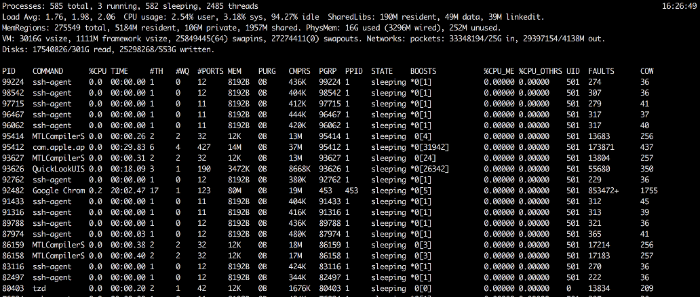

# 1. 分析 CPU

对于 CPU, 如果是常见的 Linux 系统, 可以先用 top 命令查看负责情况


可以看到, 平均负载(load average) 三个值(分别是 1 分钟, 5 分钟, 15 分钟)非常低, 并且没有升高的迹象, 如果这些数值非常高(超过 50%), 并且短期平均高于长期平均值, 则表明负载很重; 还有升高的趋势, 那么就非常警惕了;

关于定位最耗费 CPU 的 Java 线程
#### 1. 利用 top 命令获取相应的 pid
`-H` 代表 thread 模式, 可以配合 grep 命令定位
```bash
top -H
```

#### 2. 转换为 16 进制
```bash
printf "%x" your_pid
```

#### 3. 利用 stack 获取的线程栈
```bash
jstack your_pid
```

# 2. 内存
利用 `free` 命令查看内存

```bash
free -m

free -m
             total       used       free     shared    buffers     cached
Mem:          2016       1973         42          0        163       1497
-/+ buffers/cache:        312       1703
Swap:         4094          0       4094
```

# 3. 分析 IO
即可能是磁盘 IO, 也可能是网络 IO, 利用 `iostat` 等命令可以判断磁盘的健康状况