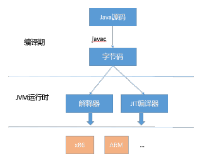

# 1. JVM 对 Java 代码的优化
JVM 在对代码的优化上, 主要可以分为运行时优化(runtime)和即时编译器优化(JIT).
- 运行时优化主要是解释执行和动态编译通用的一些机制, 比如说锁机制(偏斜锁), 内存分配机制等
- JIT 优化是指将热点代码以方法为单位转换成机器码, 直接运行在底层硬件之上, 它采用了多种优化方式, 包括静态编译器可以使用的如方法内联, 逃逸分析

JVM 会根据统计信息, 动态决定什么方法被编译, 什么方法被解释执行, 即使是已经编译过的代码, 也可能在不同阶段不再是热点.

`intrinsic` 机制, 或者叫做内建方法, 针对特别重要的基础方法, JDK 团队直接提供定制实现(比如在 JVM 另一篇文章中的 String 类 API, 参考 [String, StringBuffer, StringBuilder 的区别](https://github.com/DestinyWang/interview/blob/master/blogs/core/string-stringbuilder-stringbuffer.md)), 利用汇编或者编译器的中间表达方式编写, 然后 JVM 会直接在运行时进行替换

而 JIT, 则是更多优化工作的承担着, JIT 对 Java 编译的基本单元是方法, 通过对方法调用的统计数据吗甄别出热点方法, 编译为本地代码

# 2. JIT 概念
当 JVM 执行代码时, 它并不立即开始编译代码. 这主要有两个原因:
1. 首先, 如果这段代码本身在将来只会被执行一次, 那么从本质上看, 编译就是在浪费精力. 因为将代码翻译成 Java 字节码相对于编译这段代码并执行代码来说,要快很多.  
当然, 如果一段代码频繁的调用方法, 或是一个循环, 也就是这段代码被多次执行, 那么编译就非常值得了. 因此, 编译器具有的这种权衡能力会首先执行解释后的代码, 然后再去分辨哪些方法会被频繁调用来保证其本身的编译. 其实说简单点, 就是 JIT 在起作用, 我们知道, 对于 Java 代码, 刚开始都是被编译器编译成字节码文件, 然后字节码文件会被交由 JVM 解释执行, 所以可以说 Java 本身是一种半编译半解释执行的语言. Hot Spot VM 采用了 JIT compile 技术, 将运行频率很高的字节码直接编译为机器指令执行以提高性能, 所以当字节码被 JIT 编译为机器码的时候, 要说它是编译执行的也可以. 也就是说, 运行时, 部分代码可能由 JIT 翻译为目标机器指令(以 method 为翻译单位, 还会保存起来, 第二次执行就不用翻译了) 直接执行.
2. 第二个原因是最优化, 当 JVM 执行某一方法或遍历循环的次数越多, 就会更加了解代码结构, 那么 JVM 在编译代码的时候就做出相应的优化.

我们将在后面讲解这些优化策略, 这里, 先举一个简单的例子: 我们知道 `equals()` 这个方法存在于每一个 Java Object 中(因为是从 Object class 继承而来) 而且经常被覆写. 当解释器遇到 `b = obj1.equals(obj2)` 这样一句代码, 它则会查询 obj1 的类型从而得知到底运行哪一个 `equals()` 方法, 而这个动态查询的过程从某种程度上说是很耗时的.

在主流商用JVM(HotSpot、J9)中, Java程序一开始是通过解释器(Interpreter)进行解释执行的. 当JVM发现某个方法或代码块运行特别频繁时, 就会把这些代码认定为`热点代码(Hot Spot Code)`, 然后JVM会把这些代码编译成与本地平台相关的机器码, 并进行各种层次的优化, 完成这个任务的编译器称为 `即时编译器(Just In Time Compiler，JIT)`

