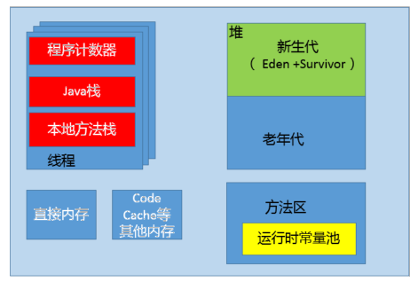

# 1. JVM 内存划分
1. 程序计数器, 每个线程都有自己的程序计数器, 并且任何时间一个线程都只有一个方法在执行, 程序计数器会存储当前线程正在执行的 Java 方法的 JVM 指令地址;
2. Java 虚拟机栈, 早期也叫做 Java 栈, 每个线程在创建时都会创建一个虚拟机栈, 内部保存一个栈帧, 对应一次次的 Java 方法调用;  
在一个时间点, 对应的只会有一个活动的栈帧, 通常叫做当前帧, 方法所在的类叫做当前类, 如果该方法调用了其他方法, 对应新的栈帧就会被创建出来, 成为新的当前帧, 一直到它返回结果或者执行结束, JVM 对栈的操作只有两个, 入站和出栈;
3. 堆, 它是 Java 内存管理的核心区域, 用来放置 Java 所有对象实例, 几乎所有创建的 Java 对象都是被直接分配在堆上, 对被所有的线程共享, 在虚拟机启动的时候, 我们指定的 `Xmx` 之类的参数就是用来指定最大堆空间等指标;  
堆是 GC 会终点照顾的区域, 所以堆内空间还会被不同的垃圾收集器进行进一步细分, 如新生代, 老年代等;
4. 方法区, 这也是所有线程共享的一块内存区域, 用于存储所谓的`元信息(Meta)`, 例如类结构信息, 以及对应的运行时常量池, 字段, 方法代码等等;  
早期的 Hotspot JVM 实现中有永久带, 在 JDK8 中被移除, 同时增加了元数据区;
5. 运行时常量池, 这是方法区的一部分, 包含版本号, 字段, 方法, 超类, 接口等各种信息, 还有一项信息就是常量池, Java 的常量池可以存放各种信息, 不管是编译器生成的各种字面量, 还是需要在运行时决定的符号引用, 因此它比一般语言的符号表存储的信息更加广泛.
6. 本地方法栈, 它和 Java 虚拟机栈是非常相似的, 支持对本地方法的调用, 也是每个线程都会创建一个.

这张图反应了实际中 Java 进程内存占用情况.
- 直接内存: 就是 Direct Buffer 所直接分配的内存
- Code Cache: JIT Compiler 在运行时会对热点方法进行编译, 就会将编译后的方法存储在其中

# 2. OOM 会发生在哪里
> 没有空闲内存, 并且垃圾收集器也无法提供更多的内存

- 堆内存不足是最常见的 OOM 原因之一, 抛出的错误信息是 `java.lang.OutOfMemoryError:Java heap space`, 具体原因可能包括内存泄露, 堆大小不合理, JVM 处理引用不及时等等;
- Java 虚拟机栈和本地方法栈, 问题就要复杂一些, 有可能存在递归调用且没有退出条件, JVM 会抛出 `StackOverFlowError`, 如果 JVM 尝试去扩展栈空间的时候, 就会抛出 OOM;
- 老版本 JDK, 因为永久带的大小是有限的, 并且 JVM 对永久带垃圾回收非常不积极, 永久带出现 OOM 也非常多见, 尤其是在运行时存在大量动态类型生成的场合; 类似 `intern` 字符串缓存占用太多空间, 也会导致 OOM, 异常信息 `java.lang.OutOfMemoryError:PermGen space`;
- 元数据区出现 OOM, 异常信息变成 `java.lang.OutOfMemoryError:Metaspace`