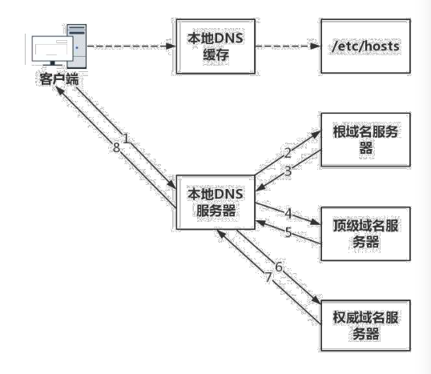

# DNS 服务

- 根 DNS: 返回顶级域 DNS 服务器的 IP 地址;
- 顶级域 DNS 服务器: 返回权威 DNS 服务器的 IP 地址;
- 权威 DNS 服务器: 返回相应主机的 IP 地址;

## 1.1 DNS 解析流程
1. 客户端发出一个 DNS 请求, 问某个域名的 IP 是什么, 并发给本地域名服务器(本地 DNS), 本地域名服务器如果是通过 DHCP 配置, 就由网络服务商自动分配, 通常就在网络服务商的某个机房.
2. 本地 DNS 收到来自客户端的请求, 这台服务器上缓存了一张域名和与之对应的 IP 地址的映射表, 如果能找到, 就直接返回 IP 地址, 如果没有, 本地 DNS 就回去问它的根域名服务器, 根域名服务器是最高的层次, 全球共有 13 套, 它不直接用于域名解析;
3. 根 DNS 收到来自本地 DNS 的请求, 发现后缀是 `.com`, 返回 `.com` 顶级域名服务器的地址;
4. 本地 DNS 转向顶级域名服务器查询, 顶级域名服务器包括 `.com`, `.net`, `.org` 等一级域名, 它负责管理二级域名, 比如 `baidu.com`, 所以它能提供提条更清晰的方向;
5. 顶级域名返回负责 `www.baidu.com` 区域的权威 DNS 服务器的地址;
6. 本地 DNS 转向权威 DNS 服务器查询;
7. 权威 DNS 查询后将对应的 IP 告诉本地 DNS;
8. 本地 DNS 再将 IP 返回给客户端, 客户端和目标建立连接.

## 1.2 负载均衡
站在客户端角度, 这是一次 DNS 递归查询过程, 因为本地 DNS 全权为他效劳, 只要等待结果即可.

在这个过程中, DNS 除了可以通过名称映射为 IP 地址, 还可以做另一件事就是负责均衡.

