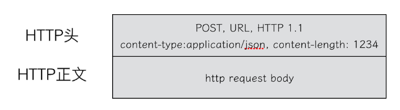
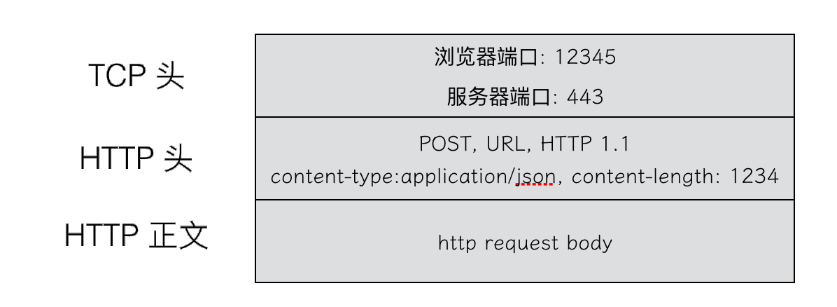
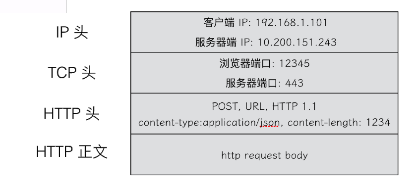

> 在浏览器中输入 www.baidu.com

# 1. DNS
> 首先, 浏览器会查询 DNS 或者 HTTPDNS, 得到 `www.baidu.com` 对应的 IP 地址, 浏览器将请求进行打包.  
DNS, HTTP, HTTPS 所在的层被称为应用层, 浏览器将应用层的包交给下一层完成.

# 2. TCP 协议进行封装
> TCP 协议中有两个端口, 浏览器监听的端口和服务器监听的端口, 操作系统根据端口号来判断得到的包应该交给哪个进程.

## 2.1 TCP 和 UDP 的区别
1. 面向连接, TCP 是面向连接的, UDP 是面向无连接的  
是为了在客户端和服务端之间维持连接, 而建立一定的数据结构来维护双方交互的状态, 用这样的数据结构来保证所谓的面向连接的特性.
TCP 提供可靠交付, 通过 TCP 连接传输的数据, 无差错, 不丢失, 不重复, 并且有序, 而 UDP 继承了 IP 包的特性, 不保证不丢失和顺序.
2. TCP 是面向字节流的, UDP 是基于数据包;
3. TCP 有拥塞控制, 当丢包或者网络带宽较差的时候, 就会根据情况调整自己的行为, 而 UDP 没有;

## 2.2 UDP
当 UDP 包到达目标机器后, 发现 MAC 地址匹配, 网络层发现 IP 头中的 `dst_ip`  匹配, 接下来, 在 IP 头中有一个 8 位的协议, 会标识这是一个 TCP/UDP 协议, 知道是 UDP 之后, 就可以将数据取出并进行解析.

处理完传输层的事情, 内核的工作基本就完成了, 里面的数据应该交给应用程序自己去处理, 传输层的特点就是需要制定端口号, 操作系统会根据端口号将数据分配给不同的进程.

UDP 的特点:
1. 沟通简单
2. 不会建立连接, 直接发送
3. 不会根据网络情况进行发包的拥塞控制

UDP 的应用场景:
1. 需要资源少, 网络情况较好, 对于丢包不敏感的内网
2. 不需要一对一沟通的场景
3. 需要处理速度快, 时延低, 可以容忍少数丢包的场景

## 2.3 TCP
### 2.3.1 TCP 包头

属性 | 功能
---|:-:
源端口号和目标端口号 | 这点和 UDP 相同
包的序号 | 为了解决数据乱序的问题
确认序号 | 如果没有收到就应该重新发送
状态位 | `SYN` 是发起连接 `ACK` 是回复 `RST` 是重新连接 `FIN` 是结束连接等 TCP 是面向连接的, 因此双方需要维护连接的状态, 发送带状态位的包, 会引起双方状态的变更;
窗口大小 | TCP 要做流量控制, 通信双方各声明一个窗口, 标识自己当前能够处理的能力

### 2.3.2 三次握手
所有的问题, 首先都要建立连接, 所以先看连接维护问题

    TCP 建立连接, 通常称为三次握手:
    1. A: 您好, 我是 A
    2. B: 您好 A, 我是 B
    3. A: 您好 B
    
#### 1. 为什么需要三次
简单来说, 是为了确认双方都确认对方具有收发能力
- 第一次握手, B 确认 A 具有发送能力;
- 第二次握手, A 确认 B 具有接受能力和发送能力;
- 第三次握手, B 确认 A 具有接受能力(因为是基于第二次握手做出的应答);

除此之外, 还为了沟通 TCP 包序号的问题

A 要告诉 B, 发起的包的序号是从哪个开始, B 同样需要告诉 A, B 发起的包的序号起始是哪个, 不能从 1 开始的原因是可能会引起冲突:

> 例如 A 连上 B 之后, 发送1, 2, 3 三个包, 但是发送 3 的时候, 中间丢了, 需要重新发送, 但 A 掉线了, 重新连上 B 之后, 序号又从 1 开始, 然后发送 2, 但此时上一次发送的 3 到了, B 自然认为这就是下一个包, 于是发生了错误.

因而, 每个连接都要有不同的序号, 这个序号的起始序号随着时间变化, 可以看成一个 32 为的计数器, 每 4ms 加一, 如果出现重复, 需要 4 个小时, 而绕路的包早已过期, 因为 IP 包头有一个 TTL(生存时间)

#### 2. 状态机
在连接建立的过程中, 双方状态变化时序图如下:

- 一开始, 客户端和服务端处于 `CLOSED` 状态;
- 服务端主动监听某个端口, 处于 `LISTEN` 状态;
- 客户端主动发起连接 `SYN`, 之后处于 `SYN-SENT` 状态;
- 服务端收到发起的连接, 返回 `SYN`, 并且 `ACK` 客户端的 `SYN`, 之后处于 `SYN-RCVD` 状态;
- 客户端收到服务端发送的 `SYN` 的 `ACK` 之后, 发送 `ACK` 的 `ACK`, 之后处于 `ESTABLISHED` 状态, 因为他的收发都成功了.
- 服务端收到 `ACK` 的 `ACK` 之后, 处于 `ESTABLISHED` 状态, 因为它的收发也都成功了.

### 2.3.3 四次挥手
断开连接时, 客户端需要通知服务端, 这个过程成为四次挥手

    1. A: 您好 B, 我需要断开连接
    2. B: 好的, 我知道了
        (此时由于 A 不再发送数据, 但 B 未必将数据全部接收, 因此需要 B 做第二次确认)
    3. B: 好的, 全部数据已收到, 可以断开, 再见
    4. A: 好的, 再见
    
#### 状态机

### 2.3.3 TCP 如何实现可靠

> TCP 协作作为一个可靠的面向流的传输协议, 其可靠性和流量控制由滑动窗口实现, 而拥塞控制则由拥塞窗口结合一系列控制算法实现.

#### 1. 顺序性
为了保证顺序性, 每个包都有一个 ID, 在建立连接的时候, 会商定其实的 ID 是什么, 然后按照 ID 一个一个发送.

为了保证不丢包, 所有的包都要进行应答, 但这个应答不是一个一个进行的, 而是会应该某一个之前的应答, 表示前面的都收了.

为了记录所有发送和丢失的包, TCP 也需要发送端和接收端分别都有缓存来保存这些记录, 发送端的缓存里是按照包的 ID 一个一个排列, 根据处理的情况分为以下四种:
1. 发送了并且已经确认的;
2. 发送了并且尚未确认;
3. 没有发送, 但是已经等待发送;
4. 没有发送, 且暂时不会发送.

在 TCP 中, 接收端会发给发送端一个窗口的大小, 叫做 `advertised window`, 这个窗口的大小应该等于上面的第二部分加上第三部分, 就是 `已经发送但没确认的` 加上 `马上要发送的`, 超过这个窗口的, 接收端做不过来就不能发送了.

接收端缓存的内容要简单一些:
1. 接收并且确认过的;
2. 还没接收, 但是马上能接收的;
3. 还没接收, 也没办法接收的.

`NextByteExprected` 和 `LastByteRead` 的差其实是还没被应用层读取的部分占用的量, 我们定义为 A

AdvertisedWindow 其实就是 MaxRcvBuffer 减去 A

#### 2. 顺序问题与丢包问题

|发送端 | 接收端 |
| --- | --- |
|1, 2, 3 已经发送并确认 4, 5, 6, 7, 8, 9 都是发送了还没确认 10, 11, 12 是还没有发出的 13, 14, 15 是接收方没有空间, 不准备发的  | 1, 2, 3 没有问题, 双发达成了一致 4, 5 接收方说 ACK 了, 但发送方还没收到, 有可能丢包, 也有可能还在路上 6, 7, 8, 9 肯定都发了, 但 8, 9 已经到了, 6, 7 肯定没有到, 出现了乱序, 缓存起来但无法 ACK

##### 假设 4 的确认到了, 不幸的是, 5 的 ACK 丢了, 6, 7 的数据包丢了, 该怎么办?
- 第一个办法是超时重试, 对每一个发送了但是没有 ACK 的包都设置一个定时器, 超时了一定时间, 就尝试重试, 估计往返时间, 需要 TCP 通过采样 RTT 的时间, 然后进行加权平均算出一个值作为估计的超时时间.

> 如果过一段时间, 5, 6, 7都超时, 就会重新发送, 接收方发现 5 原来接受过, 于是丢弃 5; 6 收到了, 发送 ACK, 要求下一个是 7, 结果 7 又丢了, 当 7 再次超时需要重传的时候, TCP 的策略是超时间隔加倍, 每当遇到一次超时重传的时候, 都会将下一次超时时间间隔设为先前值的两倍.

- 第二个办法是快速重传机制, 当接收方收到一个序号大于下一个期望的报文段时, 就检测到了数据流中的一个间隔, 于是发送三个冗余的 ACK, 客户端收到后, 就在定时器过期之前, 重传丢失的报文段.

> 接收方发现了6, 8, 9都已经接收了, 但 7 没有, 那肯定是丢包, 于是发送三个 6 的 ACK, 要求下一个是 7, 客户端收到 3 个, 就会发现 7 的包的确丢了, 不等超时, 马上重发.

#### 3. 流量控制的问题
在对于包的确认中, 同时会携带一个窗口的大小

##### 当 4 的确认到来时, 窗口会右移, 这是第 13 个包也可以发送了

##### 这时候, 如果发送过猛, 会将第三部分的 10, 11, 12, 13 全部发送完毕, 此时发送就会停止

##### 当 5 号包确认到达的时候, 在客户端相当于窗口再右移, 此时才有更多的包可以发送

### 2.3.4 拥塞处理
滑动窗口需要依赖于连接的发送端和接收端, 其并不知道网络中间发生了什么, TCP 的设计者觉得, 仅仅做到流控并不够, 因为流控只是网络模型 4 层以上的事情, TCP 还应该更聪明的感知整个网络的事情.

> TCP 通过一个 timer 采样 RTT 并计算 RTO, 但如果网络的延时突然增加, 那么 TCP 对这个事情做出的对应只有超时重传, 但超时重传会导致网络的负载更重, 进而导致更大的延迟和丢包从而进入恶性循环.  
因此, TCP 不能忽略网络上发生的事情, 而无脑的不断重发数据. TCP 不是一个自私的协议, 当拥塞发生的时候, 要做自我牺牲, 就像交通堵塞一样, 每个车都应该把路让出来而不是抢路.

拥塞控制只要包括四个算法:
1. 慢启动
2. 拥塞避免
3. 拥塞发生
4. 快速恢复

#### 2.3.4.1 慢启动
> 刚刚加入网络的连接, 一点一点地进行提速.

具体过程:
1. 连接建立好之后, 先初始化 cwnd = 1, 表明可以传一个 MSS 大小的数据.(MSS, Max Segment Size, 是 TCP数据包每次能够传输的最大数据分段)
2. 每当收到一个 ACK, cwnd++, 呈线性上升
3. 每当过了一个 RTT, cwnd = cwnd * 2, 成指数上升
4. 还有一个 `ssthresh(slow start threshold)`, 是一个上限，当cwnd >= ssthresh 时, 就会进入 `拥塞避免算法`

#### 2.3.4.2 拥塞避免
前面说过，还有一个 `ssthresh(slow start threshold)`, 是一个上限, 当cwnd >= ssthresh时, 就会进入 `拥塞避免算法`. 一般来说 ssthresh 的值是 65535, 单位是字节, 当 cwnd 达到这个值时后, 算法如下: 
1. 收到一个ACK时, cwnd = cwnd + 1/cwnd
2. 当每过一个RTT时, cwnd = cwnd + 1

这样就可以避免增长过快导致网络拥塞, 慢慢的增加调整到网络的最佳值. 很明显, 是一个线性上升的算法。

#### 2.3.4.3 拥塞发生
在丢包时, 会有两种情况:
1. 等到 RTO 之后, 超时重传, TCP 认为这种情况太糟糕
    1. ssthresh = cwnd / 2
    2. cwnd 重置为 1
    3. 进入慢启动过程
2. 快重传算法, 也就是在收到 3 个 duplicate ACK 时就开启重传, 而不用等到 RTO 超时.

#### 2.3.4.4 快速恢复
快速重传和快速恢复算法一般同时使用. 快速恢复算法是认为, 你还有 3 个 Duplicated Acks 说明网络也不那么糟糕, 所以没有必要像 RTO 超时那么强烈.

# 3. IP 协议进行封装
传输层封装完后, 将包交给操作系统的网络层, 网络层的协议是 IP 协议, 在 IP 协议中会有源 IP 地址, 即浏览器 IP 和目标 IP 地址.

# 4. 操作系统判断 IP 所在网络
操作系统知道目标 IP 后, 先判断是本地 IP 还是外部 IP, 如果是外部 IP, 就需要发送给网关, 当操作系统启动的时候, 就会被 DHCP 协议配置本机 IP 和默认网关 IP( 一般都是 192.168.1.1 )

# 5. 通过 ARP 协议获取 MAC 地址
> 操作系统通过 ARP 协议获取网关(192.168.1.1) 的 MAC 地址  
操作系统将 IP 包交给 MAC 层, 网卡再将包发出去, 通过 MAC 地址找到网关

## 5.1 集线器(Hub)
在最简单的 `集线器(Hub)` 中, 在局域网中采用广播模式, 每一台机器发出的包, 都会发送给局域网中所有的机器, 在这种情况下, 需要解决如下几个问题:
1. 数据包需要由谁来接受?
2. 数据包的发送是否会产生混乱, 需要发送顺序的规则
3. 如果发送数据包的时候出现错误(传输不完整), 如何处理

这几个问题都是数据链路层需要解决的问题.
#### 1. 数据包需要由谁来接受
这里用到一个物理地址, 叫做 `链路层地址`, 也称 `MAC 地址`.

这里需要介绍下第二层的网络包格式:

- 对于以太网, 第二层最开始就是 `源 MAC 地址` 和 `目标 MAC 地址`;
- 接下来是类型: 大部分类型是 IP 数据包, 然后 IP 里面包含 TCP, UDP 以及 HTTP 等;
- 最后是 CRC, 也就是循环冗余检测, 通过 XOR 亦或的算法, 来计算整个包是否在发送过程中出现了错误

有了这个 MAC 地址, 数据包在链路上广播, MAC 网卡才能发现这个包是发送给它的. MAC 网卡把包收进来, 然后打开 IP 包, 发现 IP 地址也是他自己, 再交给传输层, 打开 TCP 包, 发现端口也是自己

#### 2. 数据包的发送是否会产生混乱, 需要发送顺序的规则
数据链路层需要控制发送数据时的顺序问题, 防止发生混乱, 解决问题的规则主要有如下几种:
1. 信道划分: 为每个包分配不同的信道, 互不干扰;
2. 轮流协议: 轮询发送;
3. 随机接入协议: 按照发送顺序依次完成, 如果发送失败再重试, 以太网就是用这种方式.

#### 3. 如果发送数据包的时候出现错误(传输不完整), 如何处理
在数据链路层的网络包中, 最后一部分是校验码, 通过该校验码来确定网络包是否完整.

现在解决了在源机器知道目标机器的时候, 可以将目标地址放入包中, 但实际情况往往是源机器并不知道. 在一个网络中接入了多台机器, 可以使用 ARP 协议, 通过 IP 地址查询到该 IP 对应的 MAC 地址.

在局域网中, 当知道目标 IP 但不知道目标 MAC 的时候, 可以发送一个广播包, 局域网中的机器收到这个广播包之后, 对应 IP 的机器就会应答, 

为了避免每次都用 ARP 请求, 机器本地也会进行 ARP 缓存, 过一段时间就会过期.

## 5.2 交换机
一旦局域网中机器增多, 问题就出现了, 因为 Hub 是广播的方式, 不管某个接口是否需要, 都会将所有的 bit 发送出去, 让主机来判断是否需要, 一旦网络负载较高, 产生冲突的概率就提高了.

可以采用一种更加智能的方式, 只需要记住这台机器的 MAC 地址, 如果目标 MAC 地址不是这台电脑, 这个口就不用转发了.

因此需要一种能够把 MAC 头拿下来, 检查目标 MAC 地址, 然后根据策略进行精确转发的设备, 就是交换机.

## 5.3 多台交换机组成的局域网

如果网络环境中存在多台交换机, 交换机之间连接起来, 就形成一个稍微复杂的拓扑结构.

在上面的情景中, 两台交换机连接着三个局域网, 每个局域网上有都台机器, 如果机器 1 只知道机器 4 的 IP 地址, 向访问机器 4 的时候, 必须要知道机器 4 的 MAC 地址.
- 机器 1 发起广播, 机器 2 收到这个广播, 但与它无关, 因此不会做任何响应;
- 交换机 A 一开始转发表为空, 因此会将该包转发给其他所有网口;
- 机器 3 收到广播信息, 但跟它也没有关系, 因此也不会做响应;
- 交换机 B 也收到广播信息, 但同样没有任何拓普信息, 因而也进行广播, 将包广播到 `LAN 3`;
- 此时机器 4 和机器 5 收到了广播信息, 机器 4 主动响应自己的 MAC 地址, 于是一个 ARP 请求就完成了.

在上面的过程中, 交换机 AB 都是能够学习到这样的信息: 机器1 是在 `LAN 1`, 在后续转发访问机器 1 的数据包时就会变得更加高效.

> 当 src 将一个包发给 dst, 当这个包到达交换机的时候, 一开始交换机也不知道 `dst_mac` 在哪个口, 因此会进行一次广播, 但与此同时, 交换机会记住 `src_mac` 来自一个明确的口, 后面所有 `dst_mac` 是该 `src_mac` 的包, 就可以直接发送给这个口.  
当交换机工作一段时间之后, 就会拥有整个局域网的结构, 此时基本就可以完整精确投递, 我们将这个学习的结果成为 `转发表`

# 6. 网关发送数据包
> 网关收到包后, 会根据路由表判断下一步怎么走, 每个局域网内部都可以使用 MAC 地址通信.  
到达一个新的局域网, 就需要拿出 IP 头来, 当网络包知道了下一步去哪个网关, 就可以通过下一个网关的 MAC 地址找到这个网关, 直到走出最后一个网关.

在跨网关访问的时候, 会带来 MAC 地址和 IP 地址的变化,

- 在 MAC 头中, 首先是 `dst_mac`, 然后是 `src_mac`, 然后有一个协议类型, 用来说明里面是 IP 协议
- IP 头中有一个版本号, 目前主流的是 IPv4, 协议类型主要有 TOS 和 TTL, 还有 8 位标识符, 标识是 TCP 还是 UDP 协议.
- 后面是最重要的 `src_ip` 和 `dst_ip`

> 在任何一台机器, 当需要访问一个 IP 地址的时候, 都会先通过 `CIDR` 和 `子网掩码` 判断这个 IP 和当前机器的 IP 是否在同一个网段

如果是同一个网段, 那就不会经过网关, 直接将 `src_ip` 和 `dst_ip` 放入 IP 头中, 然后通过 ARP 获取 MAC 地址, 将 `src_mac` 和 `dst_mac` 放入 MAC 头中, 就可以由网卡发送出去.

但如果不是同一个网段, 就需要发往默认网关 `Gateway`, Gateway 的地址一定和 `src_ip` 是一个网段的, 往往不是第一个就是第二个, 例如 192.168.1.0/24 这个网段, Gateway 往往会是 192.168.1.1/24 或 192.168.1.2/24, 接下来如果转发, 就看 Gateway 自己的决定的.

Gateway 往往是一个路由器, 是一个三层转发设备, 主要功能是把 MAC 头和 IP 头取下来, 然后根据里面的内容, 决定接下来把包往哪里转发.

> 路由器是一个台设备, 它有五个网卡, 相当于五只手, 分别连着五个局域网, 每只手的 IP 都和所连局域网的 IP 地址有相同的网段, 每只手都是握住所连局域网的网关, 任何一个想发往其他局域网的包吗都会到达其中一只手, 被拿进路由器, 拿下 MAC 头和 IP 头, 根据自己的路由算法, 选择另一只手, 加上新的 IP 头和 MAC 头, 然后扔到新的局域网.

#### 1. 静态路由
就是在路由器上配置的规则, 这些规则包括:
- 想访问 `www.baidu.com`, 从 2 号口出去;
- 想访问公司内网, 从 3 号口出去;
- ...

每当要选择从哪只手抛出去的时候, 就逐条进行匹配, 如果找到符合的规则就转到哪个口.

#### 2. IP 头和 MAC 头的变化规则
由于 MAC 地址只在同一个局域网内才能有效, 因此, MAC 地址只要经过网关就必定会改变, 因为已经换了局域网, 而 IP 是否变化则要视情况而定.
##### 2.1 转发网关
转发网关不会改变 IP 地址

服务器 A 要访问服务器 B, 首先服务器 A 会查看 `192.168.4.101/24` 和自身是否在同一个网段, 如果不是, 就需要发送给网关 `192.168.1.1/24`, 通过 ARP 协议获取网关的 MAC 地址, 发送的数据包是这样:

| 属性 | 值
---|---
src_mac | 服务器 A 的 MAC 地址值
dst_mac | 网关 `192.168.1.1/24` 的 MAC 地址
src_ip |  `192.168.1.101/24`
dst_ip |  `192.168.4.101/24`

当包到达  `192.168.1.1/24` 这个网关, 发现 MAC 匹配, 将包接收并决定如何转发, 在路由器 A 中配置了静态路由后, 要访问  `192.168.4.0/24`, 就要从  `192.168.56.1/24` 这个出口去, 下一跳为  `192.168.1.2/24`, 于是路由器 A 发送的包为:

| 属性 | 值
---|---
src_mac |  `192.168.56.1/24` 的 MAC 地址
dst_mac |  `192.168.56.2/24` 的 MAC 地址
src_ip |  `192.168.1.101/24`
dst_ip |  `192.168.4.101/24`

当包到达 `192.168.56.2/24` 这个网关, 发现 MAC 匹配, 将包接接收并决定如何转发, 在路由器 B 中配置的静态路由发现想访问 `192.168.4.0/24`, 就要从 `192.168.4.1/24` 这个口出去, 因为该网卡就是这个网段, 因此没有下一跳了., 于是路由器 B 发送的包为:

| 属性 | 值
---|---
src_mac | `192.168.4.1/24` 的 MAC 地址
dst_mac | `192.168.1.101/24` 的 MAC 地址
src_ip |  `192.168.1.101/24`
dst_ip |  `192.168.4.101/24`

包到达服务器B, MAC 地址匹配, 将包接收.

每到一个新的局域网, MAC 都是要改变的, 但是 IP 不会变, 在 IP 头中, 不会保存任何网关的 IP 地址, 所谓下一跳就是某个 IP 要将这个 IP 地址转换为 MAC 地址放入 MAC 头中.

在整个过程中, IP 头中的地址都不会变, IP 地址在三个局域网都是可见的, 在三个局域网的网段都不会冲突, 因此在三个网段之间传输包, IP 头不会改变.

##### 2.2 NAT 网关

这里遇到的第一个问题是局域网之间没有商量过, 各定各的网段, 因而 IP 段冲突了, 服务器 A 和 B 的 IP 都是  `192.168.1.101/24`. 因此需要中间的局域网使用另外的地址.

服务器 B 在外网上要有一个国际的身份,  `192.168.56.2/24`, 在网关 B 上, 需要配置规则: 公网 `192.168.56.2/24` 对应局域网 `192.168.1.101/24`

服务器 A 在访问 B 的时候, 要指定目标地址为 `192.168.56.2/24`, 对服务器 A 来说, 由于不在一个网段, 因此需要发送给网关: 

| 属性 | 值
---|---
src_mac | 服务器 A 的 MAC 地址值
dst_mac | 网关 `192.168.1.1/24` 的 MAC 地址
src_ip |  `192.168.1.101/24`
dst_ip |  `192.168.56.2/24`

网关 A 发现 MAC 匹配, 接收并决定如何转发, 在路由器 A 中配置了如下规则:
- 想要访问 `192.168.56.2/24`, 要从 `192.168.56.1/24` 这个口出去, 没有下一跳, 因为网段是匹配的.

当网络包发送到中间的局域网的时候, 服务器 A 也需要有一个公网 IP, 因而在公网上, `src_ip` 也不能用 `192.168.1.101/24`, 需要改成 `192.168.56.1/24`

| 属性 | 值
---|---
src_mac | `192.168.56.1/24` 的 MAC 地址值
dst_mac | `192.168.56.2/24` 的 MAC 地址
src_ip |  `192.168.56.1/24`
dst_ip |  `192.168.56.2/24`

路由器 B 是一个 NAT 网关, 上面有如下配置:
- 要想访问 `192.168.1.0/24`, 就要从 `192.168.1.1/24` 这个口出去

第二种方式更为常见, 当本地的包发出去的时候, 都会被路由器 NAT 为运营商的地址.