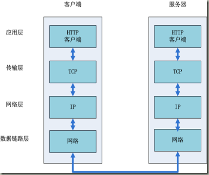

首先, 可以大致分为两个步骤:
1. 网络通信
2. 页面渲染

# 1. 网络通信
互联网内各个网络设备间的通信都遵守 TCP/IP 协议, 利用TCP/IP协议族进行网络通信时, 会通过分层顺序与对方进行通信

## 1.1 在浏览器输入 URL

用户输入url, 例如 `http://www.baidu.com`, 其中 `http为协议`, `www.baidu.com` 为网络地址, 即指出需要的资源在哪台计算机上. 一般网络地址可以为域名或IP地址, 此处为域名. 使用域名是为了方便记忆, 但是为了让计算机理解这个地址还需要把它解析为IP地址.
 
## 1.2 应用层 DNS 解析域名
客户端先检查本地是否有对应的IP地址, 若找到则返回响应的IP地址. 若没找到则请求上级DNS服务器, 直至找到或到根节点.

## 1.3 应用层客户端发送 HTTP 请求
HTTP 请求包括请求报头和请求主体两个部分, 其中请求报头包含了至关重要的信息, 包括请求的方法(GET/POST), 目标 url, 遵循的协议(http/https/ftp), 返回的信息是否需要缓存, 以及客户端是否发送 cookie 等.

## 1.4 传输层 TCP 传输报文
位于传输层的TCP协议为传输报文提供可靠的字节流服务. 它为了方便传输, 将大块的数据分割成以报文段为单位的数据包进行管理, 并为它们编号, 方便服务器接收时能准确地还原报文信息. TCP协议通过 `三次握手` 等方法保证传输的安全可靠.

`三次握手` 的过程是, 发送端先发送一个带有 `SYN(synchronize)` 标志的数据包给接收端, 在一定的延迟时间内等待接收的回复. 接收端收到数据包后, 传回一个带有 `SYN/ACK` 标志的数据包以示传达确认信息, 接收方收到后再发送一个带有 `ACK` 标志的数据包给接收端以示握手成功. 在这个过程中, 如果发送端在规定延迟时间内没有收到回复则默认接收方没有收到请求, 而再次发送, 直到收到回复为止.

## 1.5 网络层 IP 协议查询 MAC 地址
IP 协议的作用是把 TCP 分割好的各种数据包传送给接收方. 而要保证确实能传到接收方还需要接收方的 MAC 地址, 也就是物理地址. IP 地址和 MAC 地址是一一对应的关系, 一个网络设备的IP地址可以更换, 但是 MAC 地址一般是固定不变的. ARP 协议可以将 IP 地址解析成对应的 MAC 地址, 当通信的双方不在同一个局域网时, 需要多次中转才能到达最终的目标, 在中转的过程中需要通过下一个中转站的MAC地址来搜索下一个中转目标.

## 1.6 数据到达数据链路层
在找到对方的 MAC 地址后, 就将数据发送到数据链路层传输, 这时, 客户端发送请求的阶段结束

## 1.7 服务器接收数据
接收端的服务器在链路层接收到数据包, 再层层向上直到应用层. 这过程中包括在运输层通过 TCP 协议讲分段的数据包重新组成原来的HTTP请求报文.

## 1.8 服务器响应请求
服务接收到客户端发送的 HTTP 请求后, 查找客户端请求的资源, 并返回响应报文, 响应报文中包括一个重要的信息 `状态码`. 

状态码由三位数字组成, 其中比较常见的是 `200 OK` 表示请求成功. 301表示永久重定向, 即请求的资源已经永久转移到新的位置. 在返回301状态码的同时, 响应报文也会附带重定向的url, 客户端接收到后将 http 请求的 url 做相应的改变再重新发送, `404 not found` 表示客户端请求的资源找不到.

## 1.9 服务器返回相应文件
请求成功后，服务器会返回相应的HTML文件。接下来就到了页面的渲染阶段了。

# 2. 页面渲染

现代浏览器渲染页面的过程是这样的: 解析 HTML 以构建 DOM 树 –> 构建渲染树 –> 布局渲染树 –> 绘制渲染树.

DOM 树是由 HTML 文件中的标签排列组成, 渲染树是在 DOM 树中加入 CSS 或 HTML 中的 style 样式而形成. 渲染树只包含需要显示在页面中的 DOM 元素, 像 `<head>` 元素或 `display` 属性值为 `none` 的元素都不在渲染树中.

在浏览器还没接收到完整的HTML文件时, 它就开始渲染页面了, 在遇到外部链入的脚本标签或样式标签或图片时, 会再次发送HTTP请求重复上述的步骤. 在收到CSS文件后会对已经渲染的页面重新渲染, 加入它们应有的样式, 图片文件加载完立刻显示在相应位置. 在这一过程中可能会触发页面的重绘或重排.