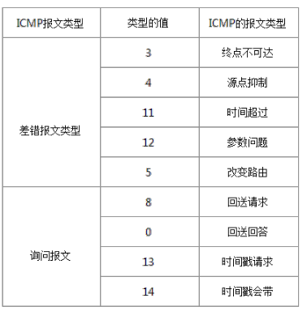

# ping 命令是如何工作到额
在遇到网络不通的时候, 往往都会去 `ping` 一下, 查看网络状况

## 1. ping 的原理
```bash
ping
```

是用来探测本机与网络中另一主机之间是否可达的命令, 如果两台主机之间 ping 不通, 则表明这两台主机不能建立连接, ping 是定位网络通不通的一个重要手段.

ping 命令是基于 ICMP 协议工作的.

> ICMP: 全称为 Internet 控制报文协议, ping 命令会发送一份 ICMP 回显请求报文给目标主机, 并等待目标主机返回 ICMP 回显应答, 因为 ICMP 协议会要求目标主机在收到消息后, 必须返回 ICMP 应答消息给源主机, 如果源主机在一定时间内收到了目标主机的应答, 则表明两台主机之间网络是可达的.

    1. 假设有两个主机, A(192.186.0.1) 和 B(192.186.0.2), 现在我们要监控两台主机之间的网络是否可达, 
        那么我我们在主机 A 上输入命令: ping 192.168.0.2;
        
    2. 此时, ping 命令会在主机 A 上构建一个 ICMP 的请求数据包, 然后 ICMP 协议会将这个数据包以及目标
        IP(192.168.0.2) 等消息一通交给 IP 层协议.
    
    3. IP 层协议得到这些信息后, 将源地址(192.186.0.1), 目标地址(192.186.0.2), 以及一些其他控制信息, 
        构建成一个 IP 数据包.
        
    4. IP 数据包构建完成后, 还不够, 还需要加上 MAC 地址, 因此, 还需要通过 ARP 映射表找出目标 IP 所对
        应的 MAC 地址. 当拿到了目标主机的 MAC 地址和本机 MAC 地址后, 一并交给数据链路层, 组装成一个数
        据帧, 依据以太网的介质访问规则, 将他们传送出去.
        
    5. 当主机 B 收到这个数据帧后, 会首先检查它的目标 MAC 地址是不是本机, 如果是, 会检查这个数据帧, 将数
        据帧中的 IP 数据包取出来, 交给本机的 IP 层, 然后 IP 层完成检查后, 再将 ICMP 数据包取出来交给 
        ICMP 协议处理, 当这一步完成后, 就会构建一个 ICMP 应答包, 回发给主机 A;
        
    6. 在一定时间内, 如果主机 A 收到了应答包, 则说明它与主机 B 之间网络可达, 反之则说明不可达.
        处理检测是否可达外, 还可以计算数据包的耗时.
        
## 2. ICMP 协议
IP 协议是一种无连接的, 不可靠的数据包协议, 它并不能保证数据一定发送成功, 因此需要引入 ICMP 来协助 IP 协议.

当传送的 IP 数据包发送异常的时候, ICMP 就会将异常信息封装在包内, 然后回传给源主机.


ICMP 协议详情:


ICMP 数据包由 8bit 的类型字段和 8bit 的代码字段以及 16bit 的校验字段再加上选项数据组成.

ICMP 协议大致可以分为两类:
- 查询报文类型
- 差错报文类型



1. 查询报文类型: 查询报文主要应用于：ping查询、子网掩码查询、时间戳查询等等.  
上面讲到的 ping 命令的流程其实就对应 ICMP 协议查询报文类型的一种使用, 在主机 A 构建 ICMP 请求数据包的时候, 其 ICMP 的类型字段中使用的是 8(回送请求), 当主机 B 构建 ICMP 应答包的时候, 其 ICMP 类型字段就使用的是 0(回送应答), 更多类型值参考上表.

2. 差错报文类型: 差错报文主要产生于当数据传送发送错误的时候. 
它包括：目标不可达(网络不可达 / 主机不可达 / 协议不可达 / 端口不可达 / 禁止分片等), 超时, 参数问题, 重定向(网络重定向 / 主机重定向等)等等.  
差错报文通常包含了引起错误的 IP 数据包的第一个分片的 IP 首部, 加上该分片数据部分的前 8 个字节.  
当传送IP数据包发生错误的时候(例如 主机不可达), ICMP 协议就会把错误信息封包, 然后传送回源主机, 那么源主机就知道该怎么处理了.