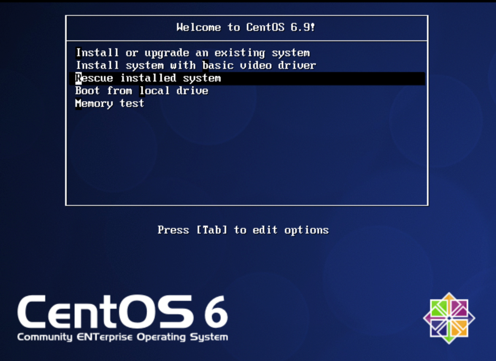
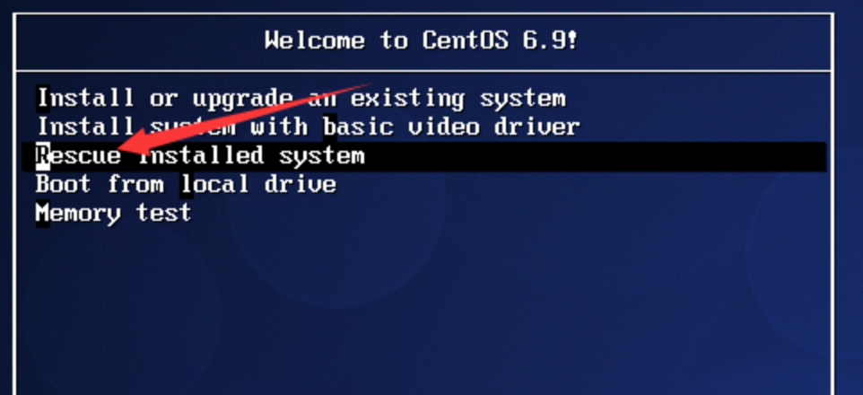
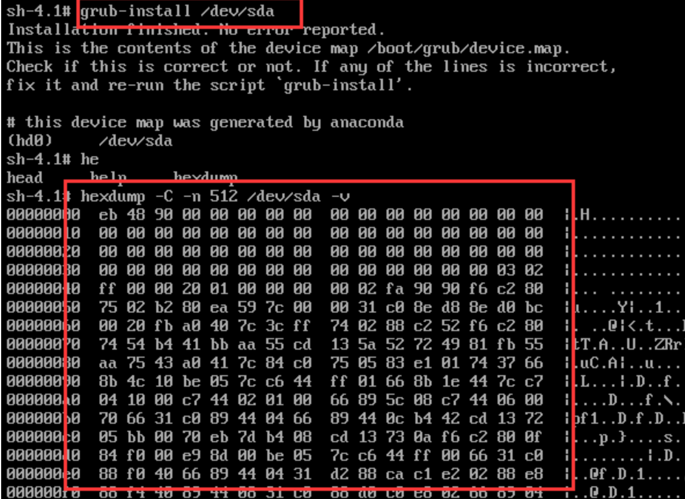
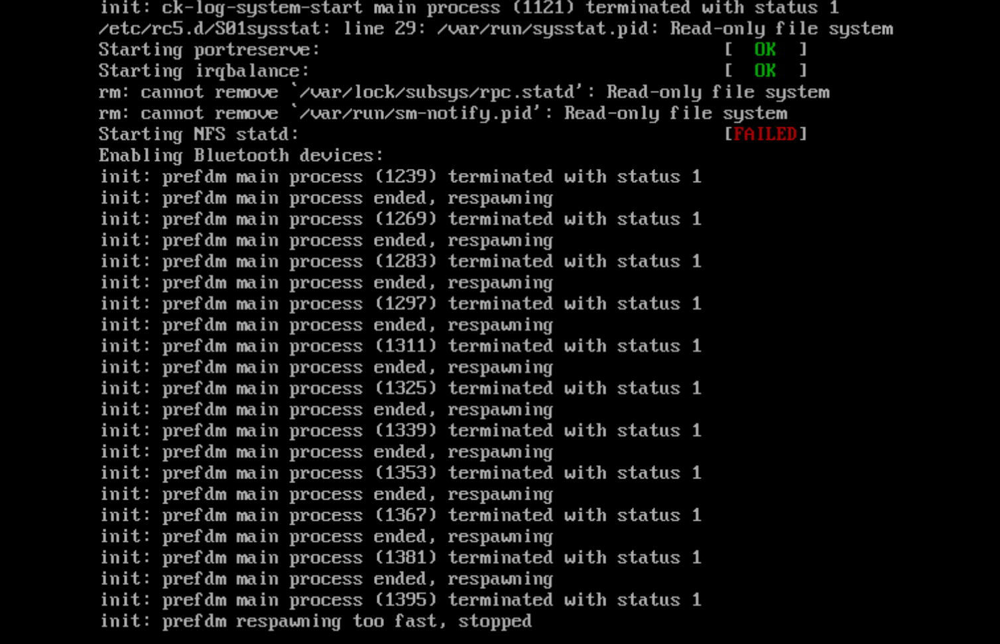
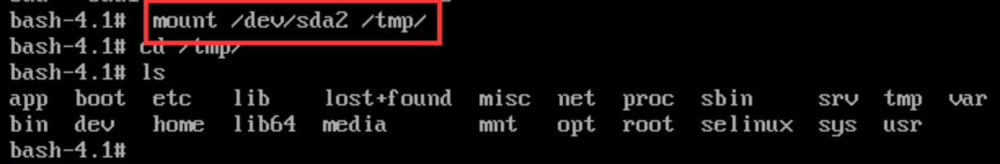
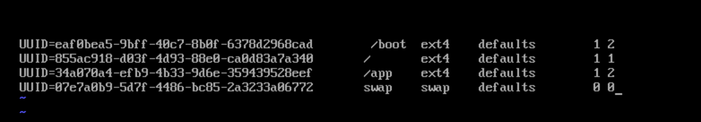
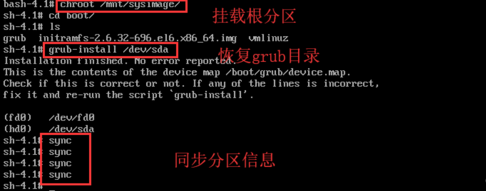
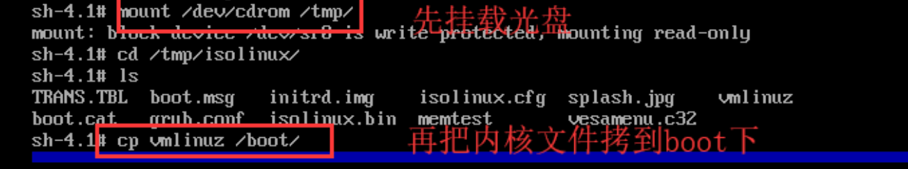
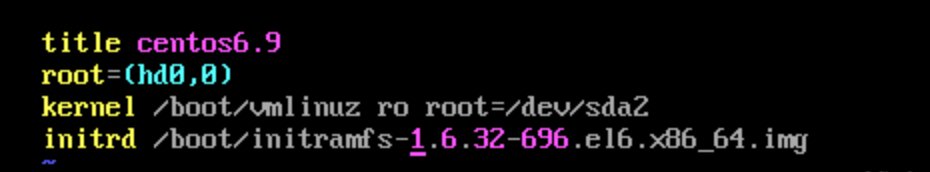

> 很多重要的启动文件及内核都是放在 `/boot` 分区下的, 所以 `/boot` 分区下的文件很大程度决定了系统能不能正常启动。

# 1. MBR扇区前446字节被破坏

| 1-446 | 447-510 | 511-512 |
| :-: | :-: | :-: |
| 调用操作系统的机器码 | 分区表 | 主引导记录签名(默认 `0x55` 和 `0xAA` ) |

当我们使用

    dd if=/dev/zero of=/dev/sda
    
命令时一不小心破坏了前 446 字节, 当时是没有任何影响的, 但是你再次启动机器时会发现变成了这样



它会找不到系统又进入到装系统界面，这时候我们需要进入到救援模式也就是光盘系统



选择启用 shell


进入 bash 下我们把原来的系统挂载到 `/mnt/sysimage` 


输入
```bash
$ grub-install
```
命令来修复 `sda` 扇区  
接着重启系统就能进入系统了  
但是我们使用 `grub-install` 只能对主引导程序进行修复  
而446到512是分区表信息, 所以我们如果破坏了512字节必须有备份才能修复.



# 2. 删除 /etc/fstab 文件的修复方法

    系统开机时会主动读取/etc/fstab这个文件中的内容, 根据文件里面的配置挂载磁盘. 
    这样我们只需要将磁盘的挂载信息写入这个文件中我们就不需要每次开机启动之后手动进行挂载了.
    
而如果我们删了 `/etc/fstab/` 文件后再次启动系统就会变成这样


同样, 我们也需要进入救援模式, 和上个步骤一样, 进入shell后我们要临时把主分区挂载到一个目录下



我们再在 `/etc` 下创建 `fstab` 表


我们在底行模式输入 `r!blkid` 把各分区信息调出来在进行编写



可以手动挂载分区，完成后进入目录下查看文件，就可以知道这个分区所对应的挂载点了。
文件编写完后，重启系统就能进入系统了。

# 3. 删除 /boot/ 目录下的所有文件后的修复

    /boot下存放的是启动Linux的一些核心文件

删除后我们再次启动机器是这个界面


我们需要明确的是要恢复什么文件，能让系统启动我们需要 `boot` 下的内核文件, `initd` 映象文件，以及grub配置文件。
首先我们先来恢复 `grub` 目录，这个时候还是要进入救援模式
步骤和前边都一样, 这里我们同样需要用 `grub-install` 命令去在 `boot` 下恢复grub目录



之后我们来恢复内核文件，内核文件可以在我们光盘的 `rpm` 包中安装



接着我们用 `mkinitrd` 命令去生成 `initrd` 映像文件


最后在 `grub` 目录下写 `grub` 的配置文件 `grub.conf`
