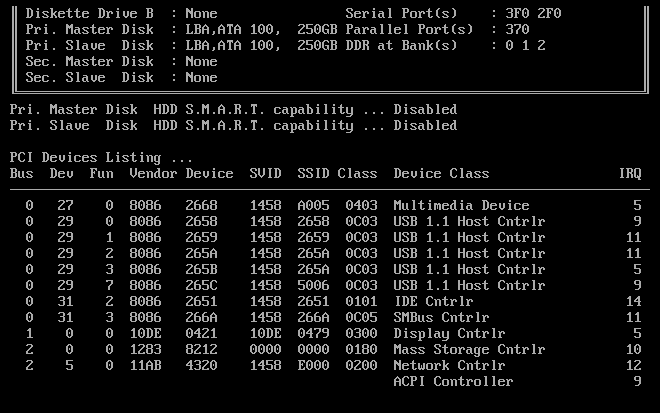
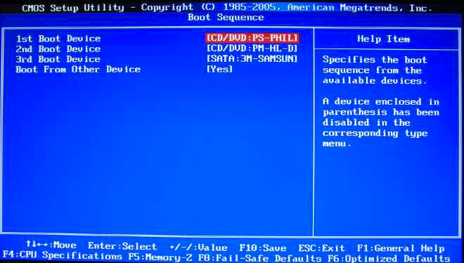

>本篇文章转自阮一峰博客:  
原文地址: [计算机是如何启动的](http://www.ruanyifeng.com/blog/2013/02/booting.html)

# 1. BIOS
上个世纪70年代初，"只读内存"（read-only memory，缩写为ROM）发明，开机程序被刷入ROM芯片，计算机通电后，第一件事就是读取它。

这块芯片里的程序叫做"基本輸出輸入系統"（Basic Input/Output System），简称为BIOS。

## 1.1 硬件自检
BIOS程序首先检查，计算机硬件能否满足运行的基本条件，这叫做"硬件自检"（Power-On Self-Test），缩写为POST。

如果硬件出现问题，主板会发出不同含义的蜂鸣，启动中止。如果没有问题，屏幕就会显示出CPU、内存、硬盘等信息。

## 1.2 启动顺序
硬件自检完成后，BIOS把控制权转交给下一阶段的启动程序。

这时，BIOS需要知道，"下一阶段的启动程序"具体存放在哪一个设备。也就是说，BIOS需要有一个外部储存设备的排序，排在前面的设备就是优先转交控制权的设备。这种排序叫做"启动顺序"（Boot Sequence）。

打开BIOS的操作界面，里面有一项就是"设定启动顺序"。

    在使用优盘装系统的时候, 一把都会在这里将启动顺序修改成 USB 最优先.
    
# 2. 主引导记录
BIOS按照"启动顺序"，把控制权转交给排在第一位的储存设备。

这时，计算机读取该设备的第一个扇区，也就是读取最前面的512个字节。如果这512个字节的最后两个字节是0x55和0xAA，表明这个设备可以用于启动；如果不是，表明设备不能用于启动，控制权于是被转交给"启动顺序"中的下一个设备。

这最前面的512个字节，就叫做"主引导记录"（Master boot record，缩写为MBR）。

## 2.1 主引导记录的结构
"主引导记录"只有512个字节，放不了太多东西。它的主要作用是，告诉计算机到硬盘的哪一个位置去找操作系统。

主引导记录由三个部分组成：
1. 第1-446字节: 调用操作系统的机器码;
2. 第447-510字节: 分区表(Partition table);
3. 第511-512字节: 主引导记录签名(0x55和0xAA)。

其中，第二部分"分区表"的作用，是将硬盘分成若干个区

## 2.2 分区表
硬盘分区有很多好处。考虑到每个区可以安装不同的操作系统，"主引导记录"因此必须知道将控制权转交给哪个区。

分区表的长度只有64个字节，里面又分成四项，每项16个字节。所以，一个硬盘最多只能分四个一级分区，又叫做"主分区"。

每个主分区的16个字节，由6个部分组成
1. 第1个字节：如果为0x80，就表示该主分区是激活分区，控制权要转交给这个分区。四个主分区里面只能有一个是激活的。
2. 第2-4个字节：主分区第一个扇区的物理位置（柱面、磁头、扇区号等等）;
3. 第5个字节：主分区类型;
4. 第6-8个字节：主分区最后一个扇区的物理位置;
5. 第9-12字节：该主分区第一个扇区的逻辑地址;
6. 第13-16字节：主分区的扇区总数。

最后的四个字节（"主分区的扇区总数"），决定了这个主分区的长度。也就是说，一个主分区的扇区总数最多不超过2的32次方。

如果每个扇区为512个字节，就意味着单个分区最大不超过2TB。再考虑到扇区的逻辑地址也是32位，所以单个硬盘可利用的空间最大也不超过2TB。如果想使用更大的硬盘，只有2个方法：一是提高每个扇区的字节数，二是增加扇区总数。

# 3. 硬盘启动